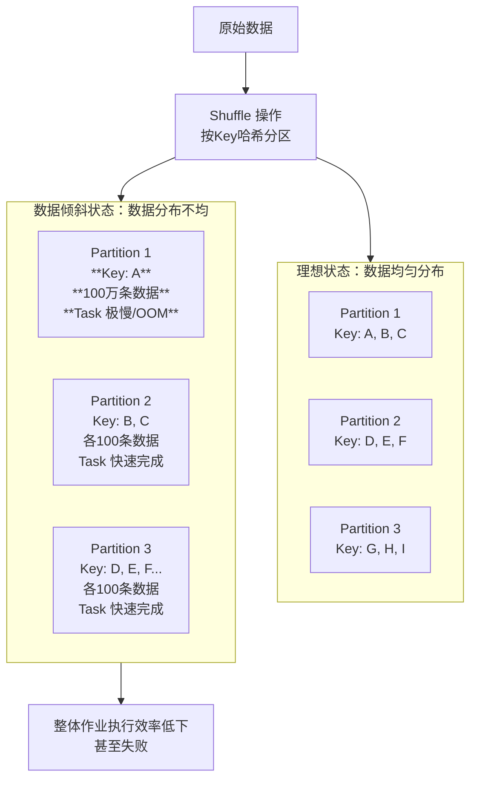
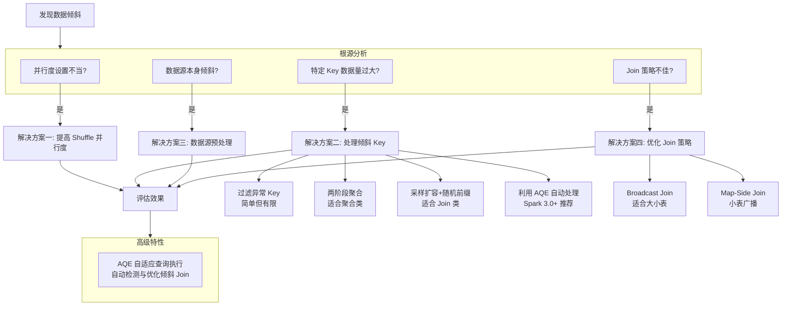
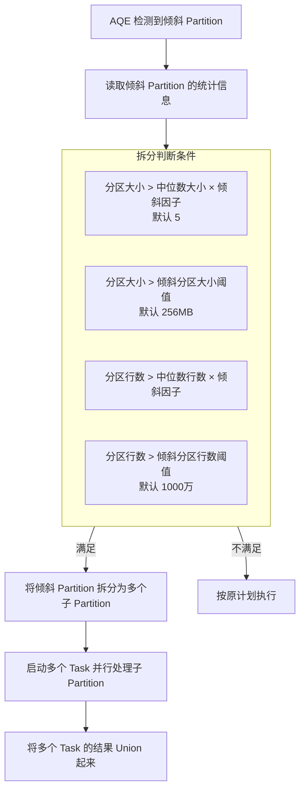
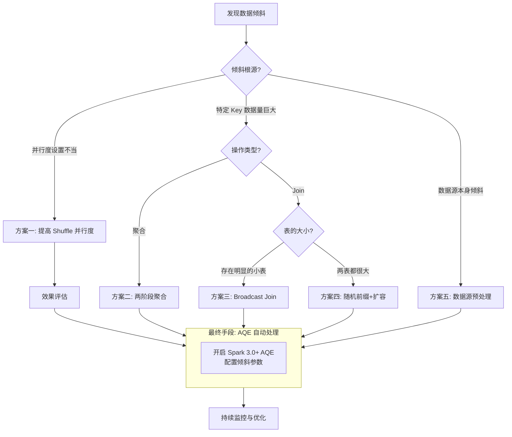

⬅️ 上一篇：[[spark性能优化3：小文件问题|小文件问题]] | 下一篇：[[spark性能优化5：资源配置与并行度优化|资源配置与并行度优化]] ➡️

> **系列导航**：[[性能优化]] | [[spark性能优化1：性能优化全景图|性能优化全景图]] | [[spark性能优化2：宽窄依赖优化|宽窄依赖优化]] | [[spark性能优化3：小文件问题|小文件问题]] | [[spark性能优化4：数据倾斜|数据倾斜]] | [[spark性能优化5：资源配置与并行度优化|资源配置与并行度优化]] | [[spark性能优化6：内存管理|内存管理]]

### 📊 一、数据倾斜：是什么与为什么

#### 1.1 核心概念

**数据倾斜 (Data Skew)** 指的是在分布式计算中，**数据在各个分区（Partition）或任务（Task）之间分布不均衡**。其最直接的后果是：**大部分 Task 迅速执行完毕，但少数 Task 处理的数据量异常巨大，执行时间极长，甚至失败**。

这会导致整个作业的完成时间被拖长，无法充分发挥分布式计算并行处理的优势，就像一个**木桶的短板**，决定了整体容量。

#### 1.2 典型现象与危害

数据倾斜在 Spark 中通常表现为以下两种典型情况，你可以通过下面的表格快速了解其特征和影响：

| 特征维度   | 情况一：Task 执行极慢                                                  | 情况二：Task 频繁 OOM                                        |
| :----- | :------------------------------------------------------------- | :----------------------------------------------------- |
| **表现** | 绝大多数 Task 在数秒/数分钟内完成，**但极少数 Task（如 1-3 个）执行时间长达数小时**，导致整个作业卡住。 | 作业在运行过程中，**总是同一个或几个 Task 频繁报出内存溢出（OOM）错误**，反复重试也无法成功。  |
| **原因** | 倾斜的 Task 被分配了远超其他 Task 的数据量。                                   | 倾斜的 Task 所需处理的数据量太大，**超过了 Executor 的内存容量**，无法在内存中完成操作。 |
| **后果** | 作业**整体运行时间远超预期**（例如从 1 小时延长至 10 小时），集群资源利用率低。                  | 作业**直接失败无法完成**，影响下游任务和数据时效性。                           |

#### 1.3 根本原因

数据倾斜本质上发生在 **Shuffle 过程**中【turn0search1】【turn0search21】。Shuffle 是 Spark 中重新分配数据的机制，它将数据按 Key 的哈希值路由到新的分区，以便后续的聚合（Aggregation）、连接（Join）等操作。



如图所示，当某个 Key（例如 "A"）的数据量异常巨大时，根据哈希分区策略，**所有 Key 为 "A" 的数据都会被分配到同一个分区（Partition 1）**，并由同一个 Task 处理。该 Task 因此成为“短板”，拖慢整个作业。

### 🔍 二、精准定位数据倾斜

解决问题前，首先要精准定位。

1.  **利用 Spark Web UI**：这是最直接有效的方法。
    *   进入你的 Spark Application 的 Web UI（通常在 `http://<driver-node>:4040`）。
    *   查看 **Jobs** 或 **Stages** 标签页，找到执行时间异常长的 Stage。
    *   进入该 Stage 的详情页面，查看 **Tasks** 列表。通常你会看到：
        *   **Duration**：一两个 Task 的执行时间远超其他 Task（可能是数十倍甚至百倍）。
        *   **Shuffle Read Size**：这几个 Task 读取的数据量也远大于其他 Task。
        *   **Input Size**：如果数据源本身倾斜，在初始 Stage 的 Task 也会看到巨大的输入差异。
    *   这就能基本锁定发生了倾斜的 Stage 和 Task。

2.  **分析代码逻辑**：数据倾斜**只会发生在 Shuffle 类算子上**。检查你的代码或 SQL，以下算子是常见的“嫌疑对象”：
    *   **聚合类**：`groupByKey`, `reduceByKey`, `aggregateByKey`, `countByKey`
    *   **连接类**：`join`, `cogroup`
    *   **去重类**：`distinct`
    *   **重分区类**：`repartition`
    *   **SQL 语句**：`GROUP BY`, `JOIN`, `DISTINCT`

3.  **采样分析倾斜 Key**（进阶）：
    *   对于倾斜严重的 Key，你可以在代码中对其进行采样统计，找出**Top N 频繁的 Key**。例如，使用 `sample` 算子对 RDD 采样，然后计算每个 Key 的出现次数。
    *   这可以帮助你**确认是哪些 Key 导致了倾斜**，为选择后续优化方案提供依据。

### 🛠️ 三、解决方案与优化策略

根据倾斜原因和场景，Spark 提供了从**参数调整**到**代码重构**的多种解决方案。下图概括了主要的优化路径，你可以先有一个整体的认识。



#### 解决方案一：提高 Shuffle 并行度（简单优先）

这是处理数据倾斜**最简单、成本最低**的方法，应首先尝试。

*   **适用场景**：并行度设置不合理（如默认的 200 太小），导致**大量不同的 Key 被意外分配到同一个 Task**，造成倾斜。
*   **操作方法**：
    *   **RDD 算子**：在调用 `reduceByKey`, `groupByKey`, `join` 等算子时，手动指定分区数。例如：`rdd.reduceByKey(_ + _, 1000)`。
    *   **Spark SQL / DataFrame**：调整配置参数 `spark.sql.shuffle.partitions`（默认 200）。例如：`spark.conf.set("spark.sql.shuffle.partitions", "1000")`。
*   **原理**：增加分区数意味着将数据切分得更细，**原本被分配到同一 Task 的不同 Key，现在有机会被分配到不同的 Task 上**，从而降低单个 Task 的负载。
*   **优点与局限**：
    *   ✅ **实现非常简单**，无需修改代码逻辑。
    *   ❌ **无法解决单个 Key 本身数据量过大**导致的倾斜。如果某个 Key 的数据量有 1GB，即使分配到一个单独的 Task，这个 Task 仍然很慢。

#### 解决方案二：处理倾斜的 Key（核心方法）

当问题根源在于**某些 Key 的数据量远大于其他 Key**时，需要针对这些 Key 进行特殊处理。

| 策略                  | 核心思想                                                   | 适用场景                                   | 优点                           | 缺点                                |
| :------------------ | :----------------------------------------------------- | :------------------------------------- | :--------------------------- | :-------------------------------- |
| **1. 过滤异常 Key**     | 直接**过滤掉**那些导致倾斜的异常 Key（如 `NULL`, `-1`, 空字符串等）。         | 倾斜 Key 对最终业务结果**影响不大**时。               | **实现简单，效果立竿见影**，完全消除倾斜。      | **有损处理**，可能丢失部分数据。                |
| **2. 两阶段聚合**（局部+全局） | 将聚合拆分为**先局部聚合（加盐）**，再**全局聚合（去盐）** 两步。                  | 适用于 `groupByKey`, `reduceByKey` 等聚合操作。 | **无损处理**，能有效打散倾斜 Key 的数据。    | 代码逻辑稍复杂，**通常需要两次 Shuffle**。       |
| **3. 采样扩容 + 随机前缀**  | 对倾斜 Key 的数据**添加随机前缀（Salt）**，将其**打散到多个分区**；Join 后再去盐合并。 | **适用于 Join 操作**，且**倾斜 Key 的数据量较大**。    | **能有效解决 Join 倾斜**，是通用性较强的方案。 | 实现相对复杂，**需要两次 Shuffle**，小表会被多次读取。 |

💡 **关于两阶段聚合的补充**：
 例如，统计每个用户（`user_id`）的访问次数，但某个超级用户（`user_id=999`）访问量巨大。
```scala
 // 第一阶段：局部聚合，给倾斜Key添加随机前缀（如0-9）
val saltedRdd = rdd.map(key => {
val prefix = if (key == 999) util.Random.nextInt(10).toString else ""
(prefix + "_" + key, 1)
}).reduceByKey(_ + _)

// 第二阶段：全局聚合，去除随机前缀
val aggregatedRdd = saltedRdd.map { case (keyWithPrefix, count) =>
val key = keyWithPrefix.split("_")(1)
(key, count)
}.reduceByKey(_ + _)
```
这样，`user_id=999` 的数据就被随机分配到了 10 个分区中进行局部聚合，大大减轻了单个 Task 的压力。

#### 解决方案三：优化 Join 策略（针对 Join 倾斜）

Join 是数据倾斜的“重灾区”，优化 Join 策略至关重要。

| 策略                     | 核心思想                                                                           | 适用场景                                               | 配置/操作                                                                                                                  |
| :--------------------- | :----------------------------------------------------------------------------- | :------------------------------------------------- | :--------------------------------------------------------------------------------------------------------------------- |
| **1. Broadcast Join**  | 将**小表**广播到所有 Executor 的内存中，**避免 Shuffle**，在 Map 端直接与大表进行 Join。                 | **大小表 Join**，且小表**能放入 Executor 内存**。               | 设置 `spark.sql.autoBroadcastJoinThreshold`（默认 10MB）调大阈值，或使用 `broadcast` hint: `SELECT /*+ BROADCAST(tableSmall) */ ...` |
| **2. Map-Side Join**   | 类似 Broadcast Join，但需要手动将小表收集到 Driver，然后广播。                                     | 同上，且对广播过程有更多控制需求。                                  | 使用 `org.apache.spark.sql.functions.broadcast` 函数。                                                                      |
| **3. AQE Skewed Join** | **Spark 3.0+ 的自动优化特性**。AQE 在运行时**动态检测倾斜的 Partition**，**自动将其拆分**，由多个 Task 并行处理。 | **Spark 3.0 及以上版本**，**SortMergeJoin**，且满足一定倾斜阈值条件。 | 开启 AQE 并配置倾斜相关参数（见后文）。**推荐优先尝试**。                                                                                      |

#### 解决方案四：数据源预处理（源头治理）

从数据生成阶段就避免倾斜，是“治本”的方法。

*   **调整数据源分布**：
    *   如果数据来自 Kafka，确保**生产者使用合适的分区策略**（如随机分区），避免将所有相同特征的数据（如同一个用户）写入同一个 Kafka 分区。
    *   如果数据来自文件，**保证输入文件的大小和数据量尽可能均匀**，避免某些文件特别大。
*   **在数据写入时预先处理**：
    *   在向 Hive 表或 Delta Lake 表写入数据时，可以**预先对可能产生倾斜的字段进行聚合或加盐**，从源头减少倾斜。

### ⚙️ 四、高级特性：AQE（自适应查询执行）

**Adaptive Query Execution (AQE)** 是 Spark 3.0 引入的革命性特性，它能在**运行时根据中间结果的统计信息动态优化物理执行计划**，其中就包含对数据倾斜的自动处理。

#### 1. AQE 如何处理倾斜 Join（Skewed Join）

其核心思想是：**在运行时自动识别倾斜的 Partition，并将其拆分为多个小的 Partition，由多个 Task 并行处理**。



#### 2. 如何启用与配置 AQE

| 参数 | 默认值 | 说明 |
| :--- | :--- | :--- |
| `spark.sql.adaptive.enabled` | `false` (Spark 3.0+) / `true` (Spark 3.2+) | **开启 AQE 的总开关**，**建议设为 true**。 |
| `spark.sql.adaptive.skewedJoin.enabled` | `true` (Spark 3.2+) | **开启 AQE 对倾斜 Join 的自动优化**。 |
| `spark.sql.adaptive.skewedPartitionFactor` | `5` | **倾斜因子**。分区大小 > 中位数 × 该因子时，视为倾斜。**调大此值可让 AQE 更激进地拆分**。 |
| `spark.sql.adaptive.skewedPartitionThresholdInBytes` | `256MB` | **倾斜分区大小阈值**。分区大小必须大于此值才可能被视为倾斜。**调小此值可让 AQE 拆分更小的分区**。 |
| `spark.sql.adaptive.advisoryPartitionSizeInBytes` | `64MB` | **目标分区大小**。AQE 会尝试将合并后的分区大小调整到此值附近。 |

> 💡 **配置建议**：
> 1.  **首先开启**：`spark.sql.adaptive.enabled=true` 和 `spark.sql.adaptive.skewedJoin.enabled=true`。
> 2.  **观察效果**：在 Spark UI 中查看 AQE 是否拆分了倾斜的 Partition。
> 3.  **根据情况微调**：如果倾斜非常严重但未被识别，可尝试**调小 `skewedPartitionThresholdInBytes`（如改为 128MB）** 或**调大 `skewedPartitionFactor`（如改为 10）**。
> 4.  **注意 Driver 内存**：AQE 需要在 Driver 上维护 MapStatus 统计信息，对于超大规模作业，**可能需要适当增加 Driver 的内存和核数**【turn0search8】。

### 📋 五、解决方案选择决策树

面对数据倾斜，你可以参考以下决策流程来选择最合适的方案：



### ⚠️ 六、最佳实践与注意事项

1.  **预防优于治疗**：在数据生成和存储阶段就考虑数据分布，从源头减少倾斜的可能性。
2.  **监控与诊断**：**定期使用 Spark UI 分析作业执行情况**，建立对数据分布和作业性能的敏感度。这是成为高阶 Spark 工程师的必修课。
3.  **渐进式优化**：优先尝试**成本最低的方法**（如提高并行度、开启 AQE），然后根据效果逐步尝试更复杂的方案。
4.  **理解权衡**：没有万能的方案。**广播 Join** 需要内存，**随机前缀** 需要额外 Shuffle，**过滤 Key** 可能丢失数据。你需要根据业务场景和技术约束做出权衡。
5.  **充分利用 AQE**：对于 Spark 3.0 及以上版本，**务必开启 AQE**，它是自动化解决倾斜问题最强大的工具。
6.  **测试与验证**：在生产环境应用任何优化方案前，**在测试环境用样本数据验证其有效性和性能影响**。

### 💎 总结

数据倾斜是 Spark 作业性能的头号杀手，但并非不可战胜。其核心是**数据分布不均**，主要发生在 **Shuffle** 过程。

*   **定位问题**：善用 **Spark Web UI**，关注 Task 的 **Duration** 和 **Shuffle Read Size**。
*   **解决思路**：
    *   **简单优先**：先**提高 Shuffle 并行度**。
    *   **针对倾斜 Key**：根据操作类型选择**过滤**、**两阶段聚合**或**随机前缀扩容**。
    *   **优化 Join**：优先用 **Broadcast Join** 处理大小表 Join。
    *   **善用高级特性**：**开启 AQE**，让其自动处理倾斜。
*   **终极目标**：**从数据源头保证均衡分布**。

掌握数据倾斜的处理方法，你就能让 Spark 作业跑得更快、更稳，真正发挥分布式计算的威力。