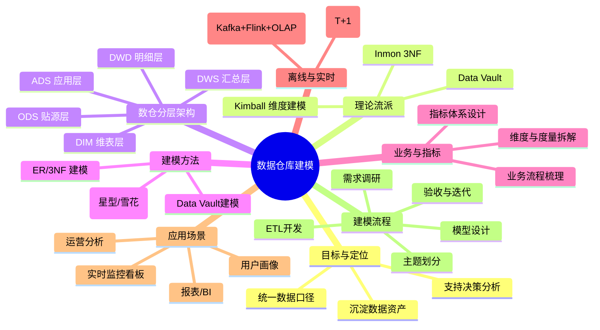

---
tags:
  - 大数据
publish date: 2025-12-29T22:17:00
title:
description:
obsidian-note-status:
  - colorful:archived
cover:
---

## 一、总框架（在脑子里要有的“地图”）

先给一个结论版的总览，方便在心里“挂住”后续的所有细节：

- 数仓建模本质就做三件事：
  1) 明白“业务怎么流转”和“数据怎么产生”（业务建模 + 需求分析）  
  2) 把数据按“层次 + 主题 + 维度 + 指标”结构化组织（体系架构 + 维度建模）  
  3) 用这套模型去支撑报表、分析、运营/产品决策等实际场景（应用落地）

- 经典理论流派：
  - Inmon：企业级数据仓库 + 3NF 建模，偏“自上而下、先全局后局部”  
  - Kimball：维度建模（星型/雪花），偏“自下而上、快速迭代建数仓”  
  - Data Vault：强调可扩展、可追溯，适合复杂多源集成  
  - 在国内互联网公司，实际常用的是：分层架构（ODS/DIM/DWD/DWS/ADS）+ Kimball 维度建模 + 适度 Data Vault 思想

- 技术架构（以离线数仓为例）：
  - 底层存储：HDFS / Hive / Hudi / Iceberg / Doris / ClickHouse 等  
  - 计算：Spark / Hive / Flink（实时数仓核心）  
  - 上层：BI 工具、API 接口、产品后台等

- 建模实践流程可以概括为：
  - 业务调研 → 指标体系设计 → 数仓分层设计 → 维度建模（事实/维度）→ 表结构设计 → ETL 实现 → 指标对账 & 优化 → 应用对接

下面这个 Mermaid 思维导图可以当成这个知识体系的主干：

下面我们一块一块展开，并在最后补上一个完整案例和一个实践学习路线。

## 二、基础概念：数据仓库和“建模”到底是干嘛的？

### 1. 数据仓库 vs 业务数据库（简单回顾）

- 业务数据库（OLTP）：
  - 面向具体业务系统（交易、订单、会员等）
  - 强调事务一致性、高并发写入
  - 表结构按业务系统功能设计，通常不适合直接做复杂分析

- 数据仓库（OLAP）：
  - 面向分析、决策支持
  - 整合多源数据（订单、行为、埋点、第三方等）
  - 数据按“主题 + 维度 + 指标”组织，为分析、报表、算法提供统一口径【turn0search9】

### 2. “数仓建模”具体在做什么？

数仓建模就是在“有了数据”和“能被业务用起来”之间搭一座结构清晰的桥：

- 明确：
  - 哪些业务域需要数据（交易、流量、内容、供应链…）
  - 每个业务域关心哪些指标和维度
- 设计：
  - 如何分层（ODS/DWD/DWS/ADS）
  - 如何划分主题域
  - 每层里面有哪些事实表、哪些维度表
- 输出：
  - 一整套表结构 + 指标口径 + 调度依赖关系
  - 让下游 BI、产品、运营能稳定地取数、分析

### 3. 三个经常混淆的概念：主题域、维度、指标（度量）

- 主题域：
  - 如：交易域、用户域、商品域、流量域、供应链域…
  - 通常按照业务板块来划分，每个主题域内建模相对独立【turn0search9】

- 维度（Dimension）：
  - 描述“从什么角度”看数据，比如：
    - 时间：日期、星期、月份、季度
    - 地域：国家、省份、城市
    - 用户：性别、年龄段、会员等级
    - 商品：类目、品牌、自营/第三方

- 指标/度量（Measure）：
  - 可聚合、可度量的数值：
    - 订单数、GMV、UV/PV、转化率、留存率、客单价…
  - 指标一般由“度量 + 维度 + 口径/计算规则”组成

## 三、理论流派：Inmon / Kimball / Data Vault 要知道什么？

不用死记细节，但要搞清楚“适用场景”和“思想差异”。

### 1. Inmon：企业级数据仓库 + 3NF 建模

- 核心思想：
  - 先建一个企业级的数据仓库（统一、规范、高度模型化）
  - 再从数仓中抽取数据到各个数据集市
- 建模方式：
  - 采用 3NF 范式模型，强调实体关系、避免冗余
- 优点：
  - 数据结构稳定、一致性好，利于长期管理
- 缺点：
  - 建设周期长、前期产出慢，对快速变化业务响应稍慢

### 2. Kimball：维度建模（目前互联网公司最常用的核心方法）

- 核心思想：
  - 数据仓库以“维度模型”为骨架，围绕业务过程构建星型/雪花型模型
  - 自下而上：优先满足业务分析需求，快速交付、持续迭代
- 基本概念：
  - 事实表（Fact）：记录具体事件或业务过程（订单、点击、加购…），包含大量指标和多个维度外键
  - 维度表（Dimension）：存储维度属性，如用户、商品、时间等
  - 星型模型：事实表在中间，多个维度表呈辐射状连接
  - 雪花模型：部分维度表进一步规范化拆分，减少冗余，但模型更复杂

- 适用：
  - 分析需求多、变更频繁、快速迭代的互联网公司
  - 大数据平台（Hadoop 生态）中，以“空间换时间”，允许适度冗余以提升查询性能

### 3. Data Vault：强调可扩展与可追溯

- 核心思想：
  - 使用 Hub、Link、Satellite 三种基本组件，把数据的关键标识和所有历史变化都记录下来
- 优点：
  - 适应复杂多源集成、业务变化频繁
  - 方便做审计、追溯
- 实际情况：
  - 在国内互联网数仓中，多数是“借鉴 Data Vault 思想”，而不是完全照做，比如增加链路追踪表、审计表等

你现阶段只要做到：  
“知道 Inmon 偏 3NF & 企业级、Kimball 偏维度建模 & 快速迭代、Data Vault 更关注可扩展 & 历史”，就够用了，剩下的可以在实战中慢慢补。

## 四、体系框架：数仓分层 + 维度建模 + 指标体系

### 1. 主流数仓分层：ODS / DIM / DWD / DWS / ADS

国内云厂商和互联网公司最常用的是 5 层划分：

- ODS（Operational Data Store，原始/贴源层）
  - 职责：
    - 基本不做复杂逻辑转换，保持与业务系统同结构或轻微调整
    - 完成数据同步、基础清洗（去脏、格式统一等）
  - 特点：
    - 与业务库表结构接近，便于追溯问题
    - 通常按业务系统、日期分区
- DIM（Dimension，维表层）
  - 存放数仓使用的维度表（用户、商品、组织、地区…）
  - 一般会做：
    - 多源维表合并（比如来自多个子系统的用户信息）
    - 补全维度属性、打标签
- DWD（Data Warehouse Detail，明细层）
  - 按主题域组织，对 ODS 数据做更细致的清洗、规范化
  - 典型工作：
    - 字段重命名、统一编码
    - 去重、关联维表、补全维度信息
    - 识别事件类型、拆分流（实时场景中常见）
- DWS（Data Warehouse Summary，汇总层）
  - 按“分析场景 + 粒度”做预聚合，避免每次查询都从明细扫描
  - 例子：
    - 用户日粒度汇总表：当天访问次数、下单次数、支付金额…
    - 商品日粒度汇总表：曝光、点击、下单数、GMV…
- ADS（Application Data Service，应用数据服务层）
  - 直接面向具体应用：
    - BI 报表、运营看板、产品后台数据
  - 表结构常常高度“面向报表/需求”：
    - 行：某个维度组合（例如日期 + 城市 + 一级类目）
    - 列：各种指标（GMV、订单数、转化率…）

分层的好处，可以简单理解成：  
- 每层职责清晰，减少互相影响  
- 上层可以从下层复用，避免重复逻辑  
- 对业务变更、需求变更更可控

### 2. 维度建模：从“业务过程”到“事实表 + 维度表”

结合 Kimball 的维度建模思想，实际工作中一般会遵循一个比较固定的步骤：
- 第一步：确定业务过程（Business Process）
  - 如：用户下单、支付、发货、退货；页面浏览、点击、收藏、搜索…
- 第二步：确定粒度（Grain）
  - 比如：每个订单一行；每个订单-每个商品明细一行；每次点击一行
- 第三步：确定维度
  - 从粒度出发，问：这一行数据能从哪些维度描述？
    - 时间维度、地域维度、用户维度、商品维度、渠道维度…
- 第四步：确定度量（指标）
  - 业务关心什么度量？
    - 金额、件数、次数、时长、转化结果（是否下单/是否支付）等

然后你就得到：

- 一张或多张事实表：
  - 订单事实表、曝光事实表、点击事实表…
- 若干维度表：
  - 用户维度、商品维度、时间维度、地区维度…

这些表在 DWD/DWS/ADS 中反复复用，形成“主题域 → 事实表/维度表 → 汇总表 → 应用表”的树状结构。

### 3. 指标体系设计：把“业务问题”翻译成“表结构 + SQL”

很多实战经验的差距，其实是“会不会梳理业务和设计指标体系”的差距，而不仅仅是 SQL/Hive 会不会写。指标体系设计的一些关键点：

- 明确业务目标：
  - 例如电商的：提升 GMV、提升转化率、提升复购率
  - 内容平台的：提升 DAU、人均时长、留存率、广告收入
- 划分指标类型：
  - 原子指标：不可再拆的最小指标，如订单数、支付金额
  - 派生指标：由原子指标计算而来，如转化率（支付订单数/曝光订单数）、客单价（GMV/支付用户数）
  - 维度组合指标：比如“某地区 + 某类目下的 GMV”
- 统一口径与命名规范：
  - 比如规定“GMV”包含哪些状态订单，是否剔除退款，是否包含运费
  - 命名统一：dws_user_daily_dau、dws_trade_user_gmv 等
- 建立指标字典：
  - 对外提供：指标说明、计算公式、负责人、下游使用场景
  - 对内指导数仓表结构设计（哪些度量要落到哪张表）

## 五、离线数仓 vs 实时数仓：建模思路的延续与变化

### 1. 离线数仓（T+1）

- 典型架构：
  - 数据源（业务库、埋点日志） → ODS（同步/采集） → DWD/DWS（Spark/Hive 计算每日分区） → ADS（每日结果表供报表）
- 建模重点：
  - 分层、维度模型、指标体系设计
  - 调度依赖管理、增量/全量策略
  - 关注数据一致性、回溯方便、成本（存储 + 计算）

### 2. 实时数仓（Lambda / Kappa 架构）

- 典型组件：
  - 日志/业务库 CDC → Kafka → Flink 实时计算 → OLAP 存储（如 Doris、ClickHouse）或 Kafka → 应用查询
- 分层思路相似：
  - ODS 层：对应原始 Topic，保存原始流
  - DWD 层：Flink 清洗、拆分流、关联维表（维表可以存 Redis/HBase/外部存储）
  - DWS 层：按窗口做聚合（分钟级、小时级）
  - ADS 层：写进 OLAP 存储或直接提供 API
- 建模差异点：
  - 更关注延迟、状态管理、窗口策略、exactly-once 语义
  - 常常需要“实时”和“离线”两套链路，但模型设计上尽量共享同一套维度/指标体系，保证口径一致

## 六、一个完整的电商订单域建模案例（离线视角）

下面用一个简化电商例子，把前面内容串起来。

### 1. 业务背景与目标

- 业务：电商平台，关心订单域的：
  - 每日、每周、每月的 GMV、订单数、客单价、各渠道转化率
  - 按地区、类目、品牌、会员等级等维度分析
- 目标：
  - 建设订单域数仓，支持：
    - 老板/运营看大盘报表（大盘趋势）
    - 区域/品类运营看各自细分指标
    - 产品团队做 AB 实验分析

### 2. 指标体系梳理（简化）

- 维度：
  - 时间：日期、星期、月份
  - 地区：国家、省、城市
  - 用户：新老用户、会员等级
  - 商品：一级类目、二级类目、品牌
- 指标：
  - 原子指标：
    - 订单数、支付订单数、GMV、支付用户数、商品件数
  - 派生指标：
    - 转化率（支付订单数/下单订单数）
    - 客单价（GMV/支付用户数）
    - 复购率（一定时间内多次支付用户数/总支付用户数）

### 3. 分层建模设计

- ODS 层：
  - ods_order_main：订单主表（与业务库结构基本一致）
  - ods_order_item：订单明细表
  - ods_user、ods_user_delivery、ods_product、ods_category 等

- DIM 层：
  - dim_user_info：整合多个系统来源的用户信息（基本信息 + 会员标签）
  - dim_region：地区维度表（省/城市等）
  - dim_product：商品维度（含类目、品牌等）
  - dim_date：日期维度（年、季度、月、周、是否节假日等）

- DWD 层：
  - dwd_trade_order_detail：
    - 粒度：每订单-每个商品一行
    - 主要字段：
      - order_id, item_id, user_id, sku_id
      - 日期、地区、渠道
      - 订单状态、支付状态、金额、件数
    - 清洗：
      - 过滤非法数据（测试订单、异常金额）
      - 统一状态码、时间格式
    - 关联维度：
      - user_id → dim_user_info
      - sku_id → dim_product
      - 地区信息 → dim_region

- DWS 层：
  - dws_trade_user_daily（用户粒度）：
    - 每个用户每天一行
    - 字段：
      - user_id, date, region_id, membership_level
      - order_cnt, pay_order_cnt, gmv, pay_amt…
  - dws_trade_sku_daily（商品粒度）：
    - 每个商品每天一行
    - 指标：
      - 曝光数、点击数、下单数、支付数、GMV
  - dws_trade_region_daily（地区粒度）：
    - 每个地区每天一行
    - 汇总该地区所有订单/用户指标

- ADS 层：
  - ads_trade_region_daily_report：
    - 行：date + region_id
    - 列：
      - order_cnt, pay_order_cnt, gmv, pay_user_cnt
      - conversion_rate, aov, …
  - ads_trade_category_daily_report：
    - 行：date + category_id
    - 列：同上，但粒度到类目

### 4. 实践中的小坑和注意点

- 指标口径反复变：
  - 比如：GMV 是否包含退款订单，是否包含未支付订单
  - 解决：
    - 提前在“指标字典”中写明口径
    - 数仓版本控制，重大口径变更时表名或字段名微调
- 维度表变更：
  - 用户归属的省/城市调整，类目结构调整
  - 解决：
    - 维度表增加生效时间/失效时间，支持历史分析
- 回溯与重跑：
  - 当上游数据有问题或口径变更时，需要重跑 DWD/DWS/ADS
  - 建模时尽量保证依赖关系清晰、任务幂等（重跑结果一致）

## 七、一个简化的实时数仓建模例子（流量域）

以“实时流量看板”为例，展示实时建模思路：

- 场景：
  - 产品/运营想要一个“实时流量看板”：
    - 实时 UV/PV（近 5 分钟、近 1 小时、今日累计）
    - 按页面、渠道、版本等维度分解

- 数据流：
  - 埋点日志 → Kafka（ods_traffic_log）
  - Flink DWD：
    - 清洗、解析埋点字段
    - 识别新老用户、会话（session）
    - 拆分不同事件（pv、click、api…）
  - Flink DWS：
    - 以滚动/滑动窗口做聚合：
      - 近 5 分钟、近 1 小时、当天零点至今
    - 维度：页面路径、渠道、app 版本
  - 写入 Doris/ClickHouse 作为 ADS 层：
    - 前端看板接口直接查询

- 建模要点：
  - 尽量与离线指标口径统一（如 PV/UV 定义）
  - 注意“窗口”粒度和状态大小，防止 Flink 任务 OOM
  - 支持回溯：窗口聚合结果通常建议再写一份到离线数仓，便于历史对账

## 八、如何系统学习并形成自己的知识框架？  
用一条“从业务到数仓到应用”的主线，把所有零散知识点往这条线上挂。

### 1. 建立自己的三主线

- 线索 1：业务线
  - 业务流程 → 主题域划分 → 关键业务问题 → 指标体系
- 线索 2：数仓线
  - 分层架构（ODS/DIM/DWD/DWS/ADS）→ 维度建模（事实/维度）→ 模型迭代
- 线索 3：技术线
  - 离线数仓（Hive/Spark）& 实时数仓（Kafka+Flink+OLAP）
  - 调度系统（Airflow、DolphinScheduler…）
  - 数据治理（元数据、血缘、质量监控）

然后，每看一篇文章、一个案例，都问自己：
- 它属于哪条线索？
- 它在“业务 → 数仓 → 应用”的哪个环节？

### 2. 用一个标准项目模板来练习

你可以自己在本地或测试环境做一个小项目（哪怕用公开数据集），刻意练习一整套流程：

- 步骤：
  1) 选一个小业务域（例如“网站访问”“线上课堂学习”）
  2) 画业务流程图，列出关键业务问题
  3) 设计指标体系（维度 + 指标列表）
  4) 设计分层结构：
     - ODS 表有哪些？
     - DWD 事实表有哪些，分别代表什么业务过程？
     - 需要哪些 DIM 表？
     - DWS/ADS 预估哪些汇总粒度？
  5) 写建表 DDL（Hive 或你熟悉的库）
  6) 写关键 ETL SQL（哪怕只写一两层）
  7) 简单验证：查几条数据，手动对一下指标逻辑是否合理

通过这一套做一遍，你会立刻感觉到：  
原来“维度建模、分层、指标体系”这些东西，都是在帮你把“业务问题”翻译成“表结构 + SQL”，而不是各自为政。

### 3. 学习和检索的优先级建议

- 维度建模 + 数仓分层：
  - 再系统地读一遍 Kimball 维度建模的思路（不用太细，重点是事实/维度/粒度/星型模型）
  - 再看一两家云厂商/公司的分层实践文档，结合 ODS/DIM/DWD/DWS/ADS
- 指标体系设计：
  - 找几篇“指标体系搭建/指标模型设计”的文章，重点看：
    - 如何从业务到指标
    - 如何做原子指标/派生指标拆分
    - 如何管理指标字典
- 实时数仓：
  - 先看一篇文章整体了解“实时数仓架构 + 分层 + Flink 应用”，再去理解一些公司（比如快手）的 ADS 层实践

### 4. 实战中刻意练习几个“典型模式”

很多建模经验，最后会沉淀成几种“模式”，你可以有意识地去练：

- 标准事实表 + 维度表模式（交易域）
  - 设计一个完整的订单事实表 + 若干维度表
- 行为日志事实表模式（流量域）
  - 埋点数据 → pv/click 事实表 + 维度表
  - 练习如何拆分事件、如何识别会话
- 汇总表设计模式
  - 从某个事实表出发，设计不同粒度的 DWS 汇总表
  - 练习如何做到“不重复计算，又方便下游查询”
- 实时窗口聚合模式
  - 基于 Kafka + Flink，设计一个 DWD → DWS（窗口聚合）→ ADS（OLAP）的小链路

每次练完之后，用 1～2 页文档（或 Markdown）写下：
- 业务背景
- 指标体系
- 分层模型
- 关键表结构
- 遇到的问题和怎么解决

坚持写几份，你的知识就会从“散点”慢慢变成“自己的体系”。

## 九、小结：帮你收束一下“框架感”

如果用一句话概括：

- 数仓建模 = 理解业务 + 设计分层/维度模型 + 指标体系落地 + 用技术栈（离线/实时）把这一套跑起来，支撑业务决策

你接下来可以有意识地做三件事：

1) 在脑子里时刻带着一张”分层 + 维度建模 + 指标体系”的总图（就是我上面那个 mindmap）
2) 每看一个新概念、新技术，问自己：它在这张图里处在什么位置？
3) 用 1～2 个完整项目（哪怕是练习项目）把整套流程走一遍，并写成自己的”建模笔记”

## 相关笔记
- 本文的精简版参见[[数仓建模：核心方法]]，两篇互为补充

