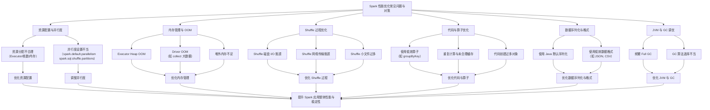
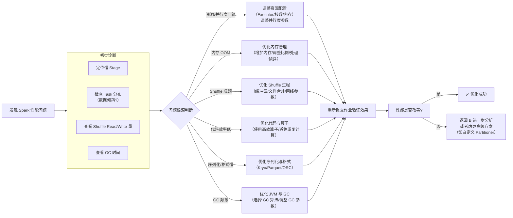

 
## 📊 Spark 性能优化全景图

为了让你先有一个整体的概念，下面的表格汇总了 Spark 性能优化中的常见问题、核心优化方向和关键参数。



---

### 🔧 一、资源配置与并行度优化

不合理的资源配置和并行度设置是 Spark 性能问题的常见根源，会导致资源利用率低、任务执行缓慢甚至 OOM。

#### 1.1 Executor 资源分配

| 组件 | 常见问题 | 优化建议 | 关键参数/示例 |
| :--- | :--- | :--- | :--- |
| **Executor 数量** | 过多导致集群资源碎片化，过少无法充分利用集群并行能力。 | 通常设置为 **10-100** 个，根据集群总资源（CPU 核数和内存）和任务特性调整【turn0search2】。 | `--num-executors` 或 `spark.executor.instances` |
| **每个 Executor 的内存** | 设置过大可能超出 YARN 队列限制，过小则易 OOM。 | 建议 **每个 Executor 分配 6-10GB** 内存，**不超过总内存的 70%**【turn0search1】【turn0search2】。 | `--executor-memory` 或 `spark.executor.memory` (如 `8g`) |
| **每个 Executor 的核数** | 过多可能导致 Executor 内部竞争激烈，GC 频繁；过少则并发度不足。 | 建议设置为 **2-5 核**，以提升任务并行度并避免 YARN 资源竞争【turn0search1】【turn0search6】。 | `--executor-cores` 或 `spark.executor.cores` (如 `4`) |

> 💡 **经验法则**：并行度（Task 数）通常设置为集群总 CPU 核数的 **2-3 倍**。例如，集群有 100 个核，那么 `spark.default.parallelism` 可设置为 200-300【turn0search2】【turn0search6】。

#### 1.2 并行度设置

*   **常见问题**：`spark.default.parallelism`（用于 RDD 操作）和 `spark.sql.shuffle.partitions`（用于 SQL/Shuffle 操作，默认 200）设置不当。
    *   **并行度过低**：每个 Task 处理的数据量过大，导致执行缓慢或 OOM。
    *   **并行度过高**：产生大量小 Task，**任务调度和启动的开销**可能超过计算本身的开销【turn0search0】。
*   **优化建议**：
    *   **RDD 操作**：通过 `sc.parallelize(data, numPartitions)` 或在算子中指定并行度（如 `reduceByKey(_ + _, 1000)`）来调整。
    *   **SQL 操作**：根据数据量调整 `spark.sql.shuffle.partitions`。**小数据集可减少至 100-200**，**大数据集或发生数据倾斜时可增加至 1000+**【turn0search1】。
    *   **全局默认值**：建议将 `spark.default.parallelism` 设置为 `total-cores * 2-3`【turn0search2】【turn0search6】。

---

### 🧠 二、内存管理与 OOM 优化

内存溢出（OOM）是 Spark 中最棘手的问题之一，通常由数据量过大、资源分配不合理或代码内存管理不当引起。

#### 2.1 Executor Heap OOM

*   **常见场景**：
    *   **Shuffle 阶段**：Reduce 端在拉取、聚合或排序数据时，内存需求激增。
    *   **Map 阶段**：映射操作产生大量对象。
    *   **数据倾斜**：个别 Task 处理远超平均量的数据。
*   **优化方案**：
    1.  **增加 Executor 内存**：直接增加 `--executor-memory`（如从 `4g` 增至 `8g`）。
    2.  **调整内存管理参数**：
        ```bash
        # 调整执行内存与存储内存的比例（默认0.6）
        --conf spark.memory.fraction=0.8
        # 调整存储内存在预留内存中的比例（默认0.5）
        --conf spark.memory.storageFraction=0.3
        ```
    3.  **增加分区数**：通过 `repartition` 或调整 `spark.sql.shuffle.partitions` 增加分区数，**减少单个 Task 处理的数据量**【turn0search11】【turn0search12】。
    4.  **优化代码逻辑**：避免使用 `groupByKey`，改用 `reduceByKey`（Map 端预聚合）以减少 Shuffle 数据量【turn0search4】。
    5.  **处理数据倾斜**：这是导致 OOM 的常见原因，需针对倾斜 Key 进行特殊处理（如加盐、广播小表等）【turn0search11】【turn0search12】。

#### 2.2 Driver OOM

*   **常见场景**：
    *   使用 `collect()` 等操作将**大量 Executor 端数据回收到 Driver**。
    *   在 Driver 端**创建过大的本地集合或对象**。
*   **优化方案**：
    1.  **避免 collect 大数据集**：将 Driver 端的逻辑转化为 RDD 操作。例如，用 `rdd.foreach()` 代替 `collect().foreach()`。
    2.  **增大 Driver 内存**：通过 `--driver-memory` 增加内存（如 `4g`）。
    3.  **限制 collect 大小**：设置 `spark.driver.maxResultSize`（默认 1g），**限制回收结果的最大大小**【turn0search13】。注意，此参数是序列化后的大小，反序列化后所需内存可能膨胀数倍。
    4.  **利用分布式存储**：将结果直接写入分布式文件系统（如 HDFS、S3），而非回收本地。

#### 2.3 堆外内存不足

*   **常见问题**：Spark 的堆外内存用于直接缓冲区、网络传输等。默认为 Executor 内存的 10%，处理大数据时可能不足，导致连接失败、Executor 丢失等。
*   **优化方案**：显式增大堆外内存。
    ```bash
    --conf spark.memory.offHeap.enabled=true
    --conf spark.memory.offHeap.size=2g  # 根据需求调整，如 1g, 2g, 4g
    ```

---

### ⚡ 三、Shuffle 过程优化

Shuffle 是 Spark 中最耗时的阶段之一，涉及磁盘 I/O、网络 I/O 和序列化，极易成为性能瓶颈【turn0search21】【turn0search22】。

#### 3.1 Shuffle 磁盘 I/O 瓶颈

*   **常见问题**：Shuffle Write 阶段产生大量小文件，导致磁盘随机读写效率低。
*   **优化方案**：
    1.  **合并 Shuffle 文件**：设置 `spark.shuffle.consolidateFiles=true`（SortShuffleManager 默认已优化此问题），减少小文件数量【turn0search0】【turn0search3】。
    2.  **增大 Map 端缓冲区**：调整 `spark.shuffle.file.buffer`（默认 32KB），**增大到 64KB 或 128KB**，可减少写磁盘次数，提高 I/O 效率【turn0search21】。
        ```bash
        --conf spark.shuffle.file.buffer=64k
        ```
    3.  **使用多目录**：设置 `spark.local.dir` 为**多个磁盘目录**（以逗号分隔），利用多磁盘并行 I/O 能力【turn0search0】。
        ```bash
        --conf spark.local.dir=/mnt/disk1,/mnt/disk2,/mnt/disk3
        ```

#### 3.2 Shuffle 网络传输瓶颈

*   **常见问题**：Reduce Task 在拉取数据时网络拥堵，导致 Shuffle Read 缓慢。
*   **优化方案**：
    1.  **增大 Reduce 端拉取缓冲区**：调整 `spark.reducer.maxSizeInFlight`（默认 48MB），**增大到 96MB 或更高**，减少拉取次数和网络连接开销【turn0search4】【turn0search21】。
        ```bash
        --conf spark.reducer.maxSizeInFlight=96m
        ```
    2.  **调整网络重试参数**：网络不稳定时，可增加重试次数 `spark.shuffle.io.maxRetries`（默认 3）至 6-10 次，并设置重试间隔 `spark.shuffle.io.retryWait`（默认 5s）【turn0search1】。
        ```bash
        --conf spark.shuffle.io.maxRetries=6
        --conf spark.shuffle.io.retryWait=10s
        ```

#### 3.3 Shuffle Manager 选择

*   **现状**：Spark 2.0+ 默认使用 **SortShuffleManager**，它优于旧的 HashShuffleManager，**内存效率更高，GC 更友好**【turn0search24】。
*   **注意**：一般无需调整 `spark.shuffle.manager`。SortShuffleManager 已非常成熟和高效。

---

### 🧩 四、代码与算子优化

低效的代码和算子选择会直接导致性能问题。

#### 4.1 高效算子替代低效算子

| 场景 | 低效算子 | 高效算子 | 优势说明 |
| :--- | :--- | :--- | :--- |
| **聚合操作** | `groupByKey` | `reduceByKey`, `aggregateByKey` | **Map 端预聚合**，大幅减少 Shuffle 数据量，降低网络和内存压力【turn0search4】。 |
| **映射操作** | `map` | `mapPartitions` | 以分区为单位处理数据，**减少对象创建开销**，适用于操作需要频繁创建对象或连接外部系统的场景【turn0search0】【turn0search4】。 |
| **去重操作** | `distinct` | 先 `reduceByKey` 再 `map` | `distinct` 会触发 Shuffle，而先聚合再映射通常更高效。 |

#### 4.2 避免重复计算与合理缓存

*   **常见问题**：一个 RDD 被多个 Action 使用时，会重复计算。
*   **优化方案**：对重复使用的 RDD 进行缓存。
    ```scala
    val rdd = sc.textFile("...")
    rdd.persist(StorageLevel.MEMORY_AND_DISK_SER) // 建议使用序列化+内存+磁盘的级别
    // 多次使用 rdd 进行操作
    ```
    *   **选择合适的缓存级别**：`MEMORY_AND_DISK_SER` 是一个很好的起点，它能平衡内存使用和性能。
    *   **及时释放缓存**：不再使用时，调用 `rdd.unpersist()` 释放内存，避免内存泄漏【turn0search11】。

#### 4.3 代码细节优化

*   **避免创建过多临时对象**：在算子函数中，避免频繁创建对象。例如，在 `map` 中重复创建 `SimpleDateFormat` 对象，可考虑使用 `mapPartitions` 在分区级别初始化一次。
*   **使用 `foreachPartition` 替代 `foreach`**：当写入外部系统（如数据库、Kafka）时，`foreachPartition` 可以**建立一次连接处理整个分区的数据**，效率远高于 `foreach` 每条记录建立连接。

---

### 🗃️ 五、数据序列化与格式优化

数据的序列化方式和存储格式对性能影响巨大，尤其是在 Shuffle 和缓存过程中。

#### 5.1 使用 Kryo 序列化

*   **常见问题**：Spark 默认使用 Java 的 `ObjectOutputStream` 进行序列化，其**速度慢且序列化后体积大**，导致 CPU 和网络开销大【turn0search0】。
*   **优化方案**：**启用 Kryo 序列化**，性能可提升 10 倍左右。
    ```bash
    # 在 SparkConf 中设置
    conf.set("spark.serializer", "org.apache.spark.serializer.KryoSerializer")
    # 注册自定义类以获得最佳性能（可选但推荐）
    conf.registerKryoClasses(Array(classOf[MyCustomClass]))
    ```
    > 💡 **注意**：Kryo 不一定支持所有自定义类，对于复杂的类可能需要自定义序列化器。

#### 5.2 选择高效的数据格式

| 格式 | 特点 | 适用场景 | 推荐配置 |
| :--- | :--- | :--- | :--- |
| **Parquet** | **列式存储**，支持压缩和谓词下推，**读取速度快**。适合复杂查询和大数据量。 | **数据分析、数仓**、**需要读取部分列**的场景。 | 推荐。 |
| **ORC** | 类似 Parquet，**压缩率通常更高**，读取速度极快。适合 Hive 生态。 | **交互式查询**、**需要高压缩率**的场景。 | 推荐。 |
| **Avro** | 行式存储，**支持 Schema 演化**，适合数据流处理。 | **数据序列化**、**Kafka 消息**、**RPC 通信**。 | 特定场景。 |
| **JSON/CSV** | **文本格式**，**读写最慢，体积最大**，解析开销大。 | **数据交换**、**调试**、**小数据集**。 | **避免在生产环境大数据量时使用**。 |

> ⚠️ **建议**：**优先使用 Parquet 或 ORC** 格式，并配合高效的压缩算法（如 Snappy, Zstd），能显著提升 I/O 性能并降低存储成本【turn0search1】。

---

### 🗑️ 六、JVM 与 GC 调优

Spark 运行在 JVM 上，频繁的垃圾回收（GC），特别是 Full GC，会导致应用暂停（Stop-The-World），严重影响性能和稳定性【turn0search17】【turn0search18】。

#### 6.1 GC 算法选择

| GC 算法 | 工作原理 | 适用场景 | 缺点 |
| :--- | :--- | :--- | :--- |
| **G1GC** | 将堆划分为多个区域，**优先回收垃圾最多的区域**，平衡吞吐量和停顿时间。 | **大多数工作负载**，**Spark 2.x+ 默认推荐**，**平衡吞吐量和低延迟**。 | 对于超大堆（>32GB）可能需要调优。 |
| **Parallel GC** | 多线程并行标记-整理，**追求高吞吐量**，但停顿时间较长。 | **批处理任务**，**对延迟不敏感**，**追求高吞吐量**。 | **停顿时间可能很长**，不适合低延迟应用。 |
| **CMS / ZGC / Shenandoah** | 并发标记-清除，**追求低停顿时间**。CMS 已废弃，ZGC/Shenandoah 是新一代低延迟 GC。 | **对延迟极度敏感**的应用（如流处理）。 | 吞吐量可能较低，配置更复杂。 |

> 💡 **建议**：**默认使用 G1GC**。它提供了吞吐量和延迟之间的良好平衡，并且是 Spark 的默认选择。只有在遇到特定 GC 问题时才考虑切换。

#### 6.2 GC 调优实践

1.  **监控 GC**：
    *   通过 `jstat -gc <pid> 1s` 命令实时监控 GC 状态。
    *   开启 GC 日志：在 `spark-submit` 中添加：
        ```bash
        --conf "spark.executor.extraJavaOptions=-XX:+PrintGCDetails -XX:+PrintGCDateStamps -Xloggc:/path/to/gc.log"
        ```
    *   关注 **Full GC 的频率和停顿时间**。如果 Old 区使用率持续高位（>80%）且 Full GC 频繁（间隔短于 5 分钟），说明存在内存压力【turn0search17】。

2.  **调整堆内存大小**：确保 `-Xmx`（最大堆内存）和 `-Xms`（初始堆内存）设置一致，避免 JVM 动态调整堆大小时的性能抖动。`--executor-memory` 应小于 `-Xmx`，留出空间给堆外内存和 JVM 自身开销。

3.  **调整 G1GC 参数**（如遇到严重 GC 问题）：
    ```bash
    --conf "spark.executor.extraJavaOptions=-XX:+UseG1GC -XX:MaxGCPauseMillis=200 -XX:InitiatingHeapOccupancyPercent=45"
    ```
    *   `-XX:MaxGCPauseMillis=200`：**设置期望的最大 GC 停顿时间**（毫秒），G1GC 会尝试达到此目标。
    *   `-XX:InitiatingHeapOccupancyPercent=45`：**触发并发标记周期的堆占用阈值**（默认 45%）。降低此值（如 35）可让 GC 更早介入，但可能增加 CPU 开销；提高此值可减少并发 GC 频率，但可能增加 Full GC 风险。

---

### 📋 七、监控与诊断工具

优化离不开有效的监控。Spark 提供了强大的工具来帮助你定位性能瓶颈。

| 工具 | 用途 | 核心关注点 |
| :--- | :--- | :--- |
| **Spark Web UI** | **最全面和直观的监控界面**。 | **Stages**：查看各 Stage 耗时，定位慢 Stage。<br> **Storage**：查看缓存 RDD 的内存占用。<br> **Environment**：查看所有配置参数。<br> **Executors**：查看各 Executor 的资源使用、日志、GC 时间等。 |
| **Driver 和 Executor 日志** | **诊断错误和异常**（如 OOM, Shuffle 错误）。 | 日志中的异常堆栈、警告信息。 |
| **集群监控工具**<br>（Ganglia, Grafana/Prometheus） | **监控集群整体资源利用率**（CPU, 内存, 网络, 磁盘 I/O）。 | **集群资源是否成为瓶颈**（如 CPU 满载、网络拥堵）。 |

> 💡 **核心思路**：当遇到性能问题时，**首先打开 Spark Web UI**，从**Jobs -> Stages** 下找到耗时的 Stage，深入查看其 Tasks 的分布（是否有数据倾斜）、Shuffle Read/Write 量、GC 时间等，从而定位根本原因。

---

### 🧭 八、优化路线图与最佳实践

面对一个 Spark 性能问题，你可以遵循以下的排查和优化路径：



**一些核心的最佳实践**：

1.  **优先调整参数，后修改代码**：参数调整（如并行度、内存）成本低、见效快，应首先尝试。
2.  **从小数据集开始测试**：在生产环境大规模应用前，**用小数据集在测试集群验证优化效果**，避免无效调优。
3.  **平衡优化目标**：优化往往需要权衡。例如，增加并行度可能提高并发，但也增加调度开销；增大缓冲区可能减少 I/O，但也增加内存压力。需根据实际场景找到平衡点。
4.  **关注数据倾斜**：数据倾斜是许多性能问题的“万恶之源”，**优先解决数据倾斜问题**，其他优化可能事半功倍。
5.  **善用广播变量和累加器**：对于小表，使用广播变量避免 Shuffle；对于计数统计，使用累加器高效聚合。

---

### ❓ 常见问题（FAQ）

**Q1：如何快速判断是资源瓶颈还是代码瓶颈？**
**A**：查看 Spark Web UI 的 Executors 页面。如果所有 Executor 的 CPU、内存使用率都很高，且 GC 时间长，很可能是资源瓶颈。如果资源使用率不高，但任务仍然很慢，则更可能是代码逻辑或数据倾斜问题。

**Q2：`cache()` 和 `persist()` 有什么区别？应该用哪个？**
**A**：`cache()` 是 `persist(StorageLevel.MEMORY_ONLY)` 的简化版。**建议始终使用 `persist()`**，并明确指定存储级别（如 `MEMORY_AND_DISK_SER`），以获得更好的容错性和内存效率。

**Q3：数据倾斜和 OOM 总是发生，有没有通用的解决思路？**
**A**：核心思路是 **“打散”或“隔离”** 倾斜的 Key。
*   **打散**：为倾斜 Key 加随机前缀（Salt），将数据分散到多个 Task 中处理（如 `reduceByKey` 的两阶段聚合）。
*   **隔离**：将倾斜 Key 的数据单独提取出来，使用更高效的方式处理（如广播小表 Join）。

**Q4：G1GC 已经很好了，为什么还需要了解其他 GC？**
**A**：G1GC 确实是默认的最佳选择。但在极端场景（如超大堆内存、对延迟有极致要求的流处理），其他 GC（如 ZGC、Shenandoah）可能提供更稳定的低延迟。了解它们有助于你在遇到问题时做出正确判断。


[[spark性能优化2：宽窄依赖优化]]
[[spark性能优化3：小文件问题]]
[[spark性能优化4：数据倾斜]]
[[spark性能优化5：资源配置与并行度优化]]
[[spark性能优化6：内存管理]]