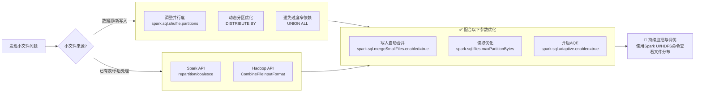

 
在 Spark 中解决小文件问题，核心思路是**从源头减少小文件的产生**，并在**写入阶段或事后对已有小文件进行合并**。下面我为你梳理了全面的原因、影响和解决方案。

### 📊 一、认识小文件问题

小文件通常是指大小**远小于 HDFS 块大小（通常为 128MB 或 256MB）** 的文件【turn0search10】【turn0search12】。它们在 Spark 作业中会带来以下主要危害：

| 影响维度 | 具体表现 | 严重后果 |
| :--- | :--- | :--- |
| **🧠 NameNode 内存压力** | 每个文件的元数据（位置、大小、权限等）约占用 **150 字节**【turn0search10】。大量小文件会严重消耗 NameNode 内存。 | NameNode 成为瓶颈，集群扩展性受限，甚至服务不稳定。 |
| **⏱️ 任务调度与执行效率低下** | 每个小文件在 Spark 中通常对应一个 Task（或 Map Task）。启动 Task、分配资源、执行短任务等操作本身就有开销。 | **任务启动与调度时间远超实际计算时间**，整体作业执行时间显著增加，资源浪费严重。 |
| **💾 磁盘与存储效率低** | 小文件占用的 HDFS 块无法被有效利用，且每个块默认有 3 份副本。 | 真实数据量可能不大，但**存储占用空间巨大**，存储成本增加。 |
| **📶 网络与 I/O 开销增大** | 处理大量小文件意味着**更频繁的磁盘寻道、打开/关闭文件操作**，以及可能的数据网络传输。 | 增加磁盘 I/O 等待和网络负载，进一步拖慢作业速度。 |


### 🤔 二、小文件为何产生？

了解成因才能从源头预防：

*   **数据源本身存在小文件**：日志采集、传感器数据等可能直接以小文件形式写入 HDFS
*   **过度动态分区**：向动态分区表插入数据时，每个动态分区值都可能产生一个 Reduce 任务，导致生成大量小文件。
*   **Task/Reduce 数量设置过多**：`spark.sql.shuffle.partitions`（默认200）或 `spark.default.parallelism` 设置过大，或使用了大量 `UNION ALL`（窄依赖，不触发 Shuffle），会导致最终输出文件数量远超预期。
*   **Spark Streaming 微批处理**：每个微批（如10秒）的每个分区都会独立输出文件。若分区数为32，一小时可能产生 (3600/10)×32 = 11,520 个文件。
*   **频繁的 `INSERT OVERWRITE` 操作**：每次写入都可能覆盖原有文件，如果每次写入数据量不大，就会累积大量小文件。

### 🛠️ 三、解决方案全方位攻略

你可以根据小文件产生阶段和场景，选择以下一种或多种方法组合使用。

#### 1. 从源头减少小文件产生（预防为主）

| 场景                  | 方法                                | 操作说明                                                                                                                                | 注意事项                                                                 |
| :------------------ | :-------------------------------- | :---------------------------------------------------------------------------------------------------------------------------------- | :------------------------------------------------------------------- |
| **动态分区表写入**         | 使用 `DISTRIBUTE BY`                | 在 `INSERT OVERWRITE` 语句末尾添加 `DISTRIBUTE BY <分区列>` 或 `DISTRIBUTE BY CAST(RAND() * N AS INT)`（N为期望文件数），控制数据写入特定分区或随机分配，**强制减少输出文件数**。 | `DISTRIBUTE BY 分区列` 可能导致每个分区目录下只有一个文件，读取时并发度低。`RAND()` 方式能更好地控制文件大小。 |
| **控制并行度**           | 调整 `spark.sql.shuffle.partitions` | 根据数据总量和集群资源**调小**此参数（例如从200设为50或更小）。它直接影响 Shuffle 后的分区数，从而影响输出文件数。                                                                  | 并行度设置过小可能导致任务执行时间变长，需在文件数量和执行速度间权衡。                                  |
| **避免大量窄依赖**         | 谨慎使用 `UNION ALL`                  | 多次 `UNION ALL` 会累积小文件。若可能，将数据先合并到一个临时表，再进行一次性写入。                                                                                    | 此操作可能增加数据读取和 shuffle 开销。                                             |
| **Spark Streaming** | 增加微批间隔 或 减少 `partition` 数         | 增大 `batchInterval`（如从10s增至100s）可减少文件总数；或在输出前使用 `coalesce` 或 `repartition` 减少 partition 数。                                           | 会增加实时性延迟。`coalesce` 不发生 Shuffle，`repartition` 会。                     |

#### 2. 写入阶段自动合并小文件（推荐优先尝试）

这是 Spark 提供的**自动化机制**，在数据写入表时自动检测并合并小文件，无需额外编码。

**关键参数配置**（在 `spark-defaults.conf` 中设置）：

| 参数                                            | 说明                | 默认值    | 推荐值与说明                                                |
| :-------------------------------------------- | :---------------- | :----- | :---------------------------------------------------- |
| `spark.sql.mergeSmallFiles.enabled`           | **启用写入时的小文件合并功能** | `true` | **务必设为 `true`**。开启后，Spark 在写入前会检查分区平均文件大小，若小于阈值则触发合并。 |
| `spark.sql.mergeSmallFiles.threshold.avgSize` | **触发合并的平均文件大小阈值** | `16MB` | 可根据需求调整，如设为 `64MB`，表示分区平均文件小于64MB就合并。                 |

**工作原理**：
开启后，Spark 会先将数据写入临时目录，然后检测每个分区下文件的平均大小。如果平均大小小于设定的阈值，Spark 会**自动启动一个专门的 Job** 来合并这些小文件，最终将合并后的大文件写入正式表目录。

> 💡 **使用约束**：此功能主要适用于 Hive 表和 DataSource 表（如 Parquet, ORC）。

#### 3. 事后合并已有小文件（补救措施）
对于已经存在的海量小文件，需要通过额外的任务进行合并。

**方法一：使用 Spark 的 `repartition` / `coalesce` API**

```scala
// 1. 读取已存在小文件的表
val df = spark.table("your_table_with_small_files")

// 2. 使用 repartition（触发Shuffle）合并文件，控制最终文件数
// 参数为你期望的文件总数
df.repartition(50) 
  .write.mode("overwrite")
  .format("parquet") // 或 ORC
  .saveAsTable("your_target_table")

// 或使用 coalesce（不触发Shuffle，但只能减少分区数）
df.coalesce(50) 
  .write.mode("overwrite")
  .format("parquet")
  .saveAsTable("your_target_table")
```

*   **`repartition(numPartitions)`**：**触发 Shuffle**，**均匀分配**数据到指定分区数，**是控制最终文件数量的最直接方法**。
*   **`coalesce(numPartitions)`**：**不触发 Shuffle**，**只是合并现有分区**。只能用于减少分区数，且无法保证数据均匀分布，**通常用于处理结果已经相当均匀，但只是分区数略多的情况**。

**方法二：通过 SQL 语句（适用于 Spark SQL）**

```sql
-- 先将数据写入临时分区
INSERT OVERWRITE TABLE your_target_table PARTITION(dt) 
SELECT * FROM source_table DISTRIBUTE BY CAST(RAND() * 50 AS INT); -- 控制50个文件
```

**方法三：使用 Hadoop 的 CombineFileInputFormat**

在 Spark 作业中配置 Hadoop 的 CombineFileInputFormat，**在读取阶段就将多个小文件合并为一个 InputSplit**，从而减少启动的 Task 数量【turn0search6】【turn0search8】【turn0search9】。

```scala
val conf = spark.sparkContext.hadoopConfiguration
// 设置每个Split的最大大小（单位：字节），如128MB
conf.set("mapreduce.input.fileinputformat.split.maxsize", "134217728")
// 设置每个节点上的最小Split大小
conf.set("mapreduce.input.fileinputformat.split.minsize.per.node", "134217728")
// 设置每个机架上的最小Split大小
conf.set("mapreduce.input.fileinputformat.split.minsize.per.rack", "134217728")

// 使用 combineInputFormat
spark.read.format("com.your.custom.CombineFileInputFormat") // 或使用内置的 CombineTextInputFormat
    .load("path/to/small/files")
```

> ⚠️ **注意**：此方法主要用于**读取**阶段优化，并不能直接合并输出文件，但能显著减少读取已有小文件时的任务数。

#### 4. 高级优化与参数调优

除了上述方法，还可以通过以下参数进一步优化：

| 参数                                      | 作用                                                              | 调优建议                                                                                                                                                                           |
| :-------------------------------------- | :-------------------------------------------------------------- | :----------------------------------------------------------------------------------------------------------------------------------------------------------------------------- |
| **`spark.sql.files.maxPartitionBytes`** | **读取时单个分区的最大字节数**（默认128MB）。影响读取时的分区合并策略。                        | 小文件多时可适当调大（如256MB），**减少读取时的分区数**。**注意：此参数主要影响读取，不直接控制写入文件大小**。                                                                                                                 |
| **`spark.files.openCostInBytes`**       | 打开文件的预估成本（默认4MB）。小于此值的文件倾向于被合并到同一个分区。                           | 可根据实际情况调整，**影响文件合并的积极程度**。                                                                                                                                                     |
| **启用 AQE (自适应查询执行)**                    | Spark 3.0+ 的特性。运行时根据中间结果数据量**动态调整 Shuffle 分区数**，并**自动合并过小的分区**。 | **强烈推荐开启**。通过设置 `spark.sql.adaptive.enabled=true`、`spark.sql.adaptive.coalescePartitions.enabled=true` 及 `spark.sql.adaptive.advisoryPartitionSizeInBytes`（推荐64MB~128MB）来自动优化。 |
| **选择合适的文件格式**                           | **Parquet 和 ORC** 等列式格式支持压缩和谓词下推，能减少文件数量和存储占用。                  | **推荐使用 Parquet 或 ORC**，并搭配高效的压缩算法（如 Snappy, LZ4）。                                                                                                                              |

### 📋 四、解决方案选择指南

你可以根据你的场景和需求，参考下面的流程来选择合适的方法：



### ⚙️ 五、操作步骤示例

1.  **配置 Spark 启用小文件自动合并**：在 `spark-defaults.conf` 中添加：
```properties
    spark.sql.mergeSmallFiles.enabled=true
    spark.sql.mergeSmallFiles.threshold.avgSize=67108864  # 64MB
```
    
2.  **使用 `repartition` 重刷数据**：
    ```scala
    val spark = SparkSession.builder.appName("MergeSmallFiles").getOrCreate()
    import spark.implicits._
    
    // 读取小文件表
    val df = spark.table("your_source_table")
    
    // 根据数据量和集群资源，决定最终分区数（例如50）
    val dfMerged = df.repartition(50)
    
    // 写入新表
    dfMerged.write.mode("overwrite").format("parquet").saveAsTable("your_target_table")
    
    spark.stop()
    ```

3.  **验证效果**：
    ```bash
    # 查看目标表的文件数量和大小
    hdfs dfs -count -h /path/to/your_target_table/*
    ```

### 📝 六、重要注意事项与最佳实践

1.  **权衡合并开销与收益**：合并本身需要额外的计算资源和时间（尤其是 `repartition` 会触发 Shuffle）。对于**数据量非常小**的情况，可能得不偿失。
2.  **避免过度合并**：合并后的单个文件也不宜过大（如超过 1GB），否则会影响数据倾斜和任务执行时的内存压力。
3.  **监控与迭代**：**持续使用 Spark UI 和 HDFS 命令**监控作业的文件分布和性能变化，根据实际情况调整参数。
4.  **选择合适的文件格式**：**优先使用 Parquet 或 ORC**，它们通常能更好地控制文件大小并提供更好的查询性能。
5.  **结合 AQE**：对于 Spark 3.0+，**务必开启 AQE**，它能在很大程度上自动缓解小文件问题，减少手动调优的负担。

### 🧰 七、实用命令与工具

*   **查看目录下文件数量和大小**：
    ```bash
    hdfs dfs -count -h /your/table/path/*
    ```
*   **查看每个文件的大小**：
    ```bash
    hdfs dfs -du -h /your/table/path/*
    ```
*   **合并 HDFS 上已有小文件（批处理方式）**：
    ```bash
    # 使用 Hadoop 的 getmerge 命令（适用于小量文本文件）
    hadoop fs -getmerge /input/smallfiles/* /local/mergedfile.txt
    
    # 然后将合并后的文件上传回 HDFS
    hdfs dfs -put -f /local/mergedfile.txt /output/mergedfile
    ```
    **注意**：此方式**不适用于二进制文件（如 Parquet/ORC）**，且对海量小文件效率不高。对于二进制文件，应优先使用 Spark 的 `repartition` 方法。