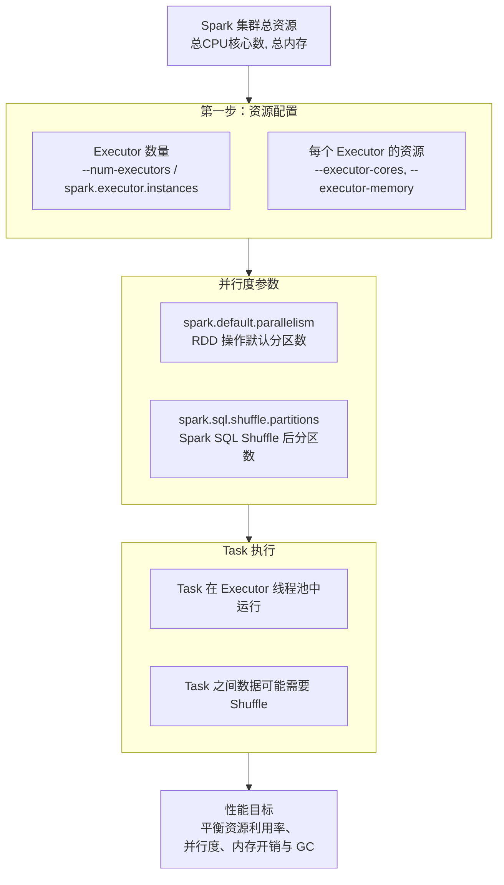
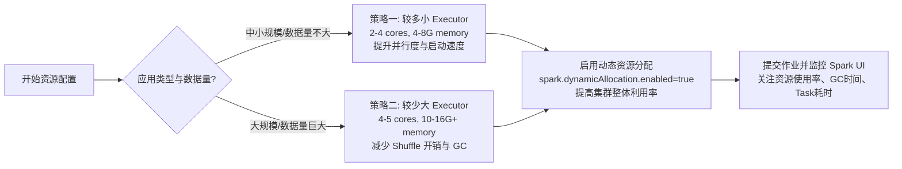

 
Spark 的资源配置与并行度调优是提升作业性能的关键。Spark 的性能很大程度上取决于**如何高效分配和利用集群资源（CPU、内存）**，以及**如何将数据合理切分并分配给这些资源**。

我梳理了下核心概念、关键参数、调优策略和实战方法。

### 🧠 一、核心概念：Executor、Task、并行度与内存模型

在深入参数之前，先理解几个核心概念和它们的关系，这能帮你更好地理解后续的参数调优。



1.  **Executor（执行器）**：集群节点上**运行应用代码、并发执行任务的进程**。它是 Spark 进行资源分配和并行计算的基本单位。
    *   **职责**：运行 Task、存储数据（内存/磁盘）、通过心跳向 Driver 汇报状态与进度。
    *   **关键参数**：
        *   `--num-executors` 或 `spark.executor.instances`：控制整个应用启动的 **Executor 总数**。
        *   `--executor-cores` 或 `spark.executor.cores`：**每个 Executor 可使用的 CPU 核心数**。这也决定了该 Executor 内同时运行的 **Task 最大数**（通常 1 个 Task 用 1 个 Core）。
        *   `--executor-memory` 或 `spark.executor.memory`：**每个 Executor 可使用的堆内存大小**。

2.  **Task（任务）**：Spark 中**直接执行计算的最小处理单元**。一个 Task 通常处理一个 RDD 分区的一批数据。
    *   **关系**：**Task 数量 ≤ (Executor 数量 × 每个 Executor 的 Core 数)**。Task 由 Executor 内的线程池执行。

3.  **并行度**：**Spark 应用中同时运行的 Task 总数**，它直接决定了集群的并行处理能力。
    *   **对于 RDD 操作**：由 `spark.default.parallelism` 控制（默认通常为集群总核心数，或基于输入分片数）。
    *   **对于 Spark SQL/DataFrame 操作**：由 `spark.sql.shuffle.partitions` 控制（默认为 **200**），它决定了 **Shuffle 过程中产生的分区数**。
    *   **核心原则**：并行度设置过低会导致资源闲置，过高则会导致过多的调度开销、GC 频繁或 Shuffle 写大量小文件。

4.  **Executor 内存模型**：Executor 的内存并非都用于计算，其分配模型如下：
    *   **Execution Memory**（执行内存）：用于 Shuffle、Join、Aggregation、Sort 等操作。
    *   **Storage Memory**（存储内存）：用于缓存 RDD、广播变量。
    *   **User Memory**：用户代码内部创建的数据结构、对象等。
    *   **Reserved Memory**：预留内存，Spark 自身开销（约 300MB），用户不可用。
    *   **关键参数**：
        *   `spark.memory.fraction`（默认 0.6）：**Execution Memory + Storage Memory** 占总内存的比例。
        *   `spark.memory.storageFraction`（默认 0.5）：**Storage Memory** 占 `(Execution Memory + Storage Memory)` 的比例。

> 💡 **关键点**：Executor 的内存大小**直接影响**它能否容纳下 Task 处理数据所需的中间结果，从而避免内存溢出（OOM）或频繁磁盘溢写。

### ⚙️ 二、关键参数详解与调优建议

掌握了核心概念后，我们来看看关键的资源配置和并行度参数，以及如何调优它们。

#### 1. Executor 资源配置

| 参数                                                       | 说明                                                              | 推荐值与调优原则                                                                                                             |
| :------------------------------------------------------- | :-------------------------------------------------------------- | :------------------------------------------------------------------------------------------------------------------- |
| **`--num-executors`**<br/>**`spark.executor.instances`** | **整个应用启动的 Executor 总数**。                                        | **中小规模集群**: 10~100 个**总原则**：`num-executors * executor-cores` ≤ 集群队列总核心数；`num-executors * executor-memory` ≤ 集群队列总内存。 |
| **`--executor-cores`**<br/>**`spark.executor.cores`**    | **每个 Executor 使用的 CPU 核心数**，也决定了该 Executor 内同时运行的 **Task 最大数**。 | **推荐**: 2~5 核 **过低**: 并行度低，资源利用不足。<br/>**过高**: YARN 资源竞争激烈，GC 频繁。                                                    |
| **`--executor-memory`**<br/>**`spark.executor.memory`**  | **每个 Executor 的堆内存大小**。                                         | **推荐**: 每个 Executor 6~10GB <br/>**避免**: 超过集群队列限制。<br/>**原则**: 在不 OOM 的前提下尽量大，给执行和缓存留足空间。                             |

> 💡 **静态 vs. 动态分配**：
> *   **静态分配**：通过 `--num-executors` 明确指定 Executor 数量，作业运行期间不变。
> *   **动态分配**：设置 `spark.dynamicAllocation.enabled=true`，让 Spark 根据工作负载**自动增减 Executor 数量**，提高集群资源利用率。
> *   **关键参数**：
>     *   `spark.dynamicAllocation.minExecutors`: 最小 Executor 数量。
>     *   `spark.dynamicAllocation.maxExecutors`: 最大 Executor 数量。
>     *   `spark.dynamicAllocation.initialExecutors`: 初始 Executor 数量。
>     *   `spark.dynamicAllocation.executorIdleTimeout`: Executor 空闲超时（默认 60s），超时则释放。

#### 2. 并行度配置

并行度决定了 Task 的总数，直接影响资源利用率和作业运行时间。**设置过低会导致资源浪费，设置过高则增加调度开销和 Shuffle 压力**。

| 参数                                 | 作用域                                           | 默认值                       | 推荐值与调优原则                                                                                                                                                                     |
| :--------------------------------- | :-------------------------------------------- | :------------------------ | :--------------------------------------------------------------------------------------------------------------------------------------------------------------------------- |
| **`spark.default.parallelism`**    | **RDD 操作**（如 `reduceByKey`, `join`）的默认分区数。    | **通常为集群总核心数**，或根据输入分片数计算。 | **推荐**: 总 Executor 核心数的 **2~3 倍**<br><br/>**公式**: `min(总数据量 / 每个Task目标处理数据量, 总Executor核心数 * 2~3)`<br/>**调整**: 在代码中通过 `repartition()` 或 `coalesce()` 显式指定。                    |
| **`spark.sql.shuffle.partitions`** | **Spark SQL** 和 **DataFrame** 的 Shuffle 后分区数。 | **200**                   | **推荐**: 根据数据量和集群资源调整<br><br/>**小数据集** (GB级): 可设为 100-200<br><br/>**大数据集** (TB级): 可设为 500-1000 或更高<br><br/>**原则**: 确保**每个 Task 处理的数据量适中**（如 128MB-256MB），避免个别 Task 处理过慢或 OOM。 |

> ⚠️ **重要区别**：
> *   `spark.default.parallelism` 主要影响 **RDD 的操作**，如果未设置，Spark 会根据集群总核心数或输入文件分片数来决定。
> *   `spark.sql.shuffle.partitions` 主要影响 **Spark SQL 和 DataFrame 的 Shuffle 过程**，它决定了 **Shuffle Write 和 Shuffle Read 阶段的分区数**。
> *   在一个作业中，可能同时涉及这两种并行度。

#### 3. 内存管理参数

优化内存分配能避免 OOM 和减少 GC 时间。

| 参数                                                                     | 说明                                                              | 推荐值与调优原则                                                                    |
| :--------------------------------------------------------------------- | :-------------------------------------------------------------- | :-------------------------------------------------------------------------- |
| **`spark.memory.fraction`**                                            | **Execution Memory + Storage Memory** 占总内存的比例。                  | **默认 0.6**<br/>**调优**: 若 Shuffle/Join 多，可适当调高（如 0.7-0.8）；若缓存多，可调低（如 0.5）。   |
| **`spark.memory.storageFraction`**                                     | **Storage Memory** 占 `(Execution Memory + Storage Memory)` 的比例。 | **默认 0.5**<br/>**调优**: 若大量使用 `cache()/persist()`，可适当调高（如 0.6）；否则可调低（如 0.4）。 |
| **`spark.memory.offHeap.enabled`**<br/>**`spark.memory.offHeap.size`** | **启用堆外内存**及其大小。                                                 | **推荐**: 堆外内存可用于 Project Tungsten、OffHeap 堆外存储等，**减少堆内 GC 压力**。              |

### 📊 三、调优策略与实战指南

了解参数后，关键是如何根据实际场景制定调优策略。

#### 1. 资源配置策略

资源配置的核心是**平衡并行度、内存占用和集群资源限制**。



*   **策略一：多小 Executor（适合中小规模作业）**
    *   **配置**：`--num-executors` 较多，`--executor-cores` 较小（如 2），`--executor-memory` 适中（如 4GB）。
    *   **优点**：并行度高，适合数据量不大的作业，能快速完成。
    *   **缺点**：Shuffle 开销可能较大（Executor 间通信多），启动 Executor 有开销。

*   **策略二：少大 Executor（适合大规模/Shuffle重的作业）**
    *   **配置**：`--num-executors` 较少，`--executor-cores` 较大（如 4-5），`--executor-memory` 较大（如 10GB+）。
    *   **优点**：每个 Executor 处理能力更强，减少跨 Executor 数据传输，适合数据倾斜或 Shuffle 重的作业。
    *   **缺点**：并行度可能受限，需要更高的并行度设置来充分利用资源。

*   **动态资源分配**：
    *   **适用场景**：集群资源紧张、应用资源需求波动大、多用户共享集群。
    *   **配置**：设置 `spark.dynamicAllocation.enabled=true`，并合理配置 `minExecutors`, `maxExecutors`, `executorIdleTimeout` 等【turn0search16】【turn0search18】。
    *   **优点**：自动适应负载，提高集群整体资源利用率，避免资源浪费。

#### 2. 并行度设置策略

并行度设置的核心是**确保 Task 数量与集群资源和数据规模相匹配**。

*   **通用经验公式**：
    ```bash
    # RDD 操作推荐并行度
    spark.default.parallelism = min(总数据量 / 每个Task目标数据量, 总Executor核心数 * 2~3)
    
    # Spark SQL/Shuffle 推荐分区数
    spark.sql.shuffle.partitions = min(总Shuffle数据量 / 每个Task目标数据量, 总Executor核心数 * 2~3)
    ```
    *   **每个 Task 目标数据量**：通常建议在 **128MB - 256MB** 之间，可根据集群内存和计算复杂度调整。

*   **分阶段设置**：
    *   **初始设置**：首次运行时可设置一个**经验值**（如总核心数的 2 倍）。
    *   **监控调整**：通过 Spark UI 观察 Stage 的 Task 耗时分布。**如果 Task 耗时差异很大**，可能存在数据倾斜或并行度设置不当；**如果多数 Task 耗时很短**，说明可能资源过剩或数据量过小，可适当减少并行度。

#### 3. 序列化与内存优化

*   **使用 Kryo 序列化**：
    *   **参数**：`spark.serializer=org.apache.spark.serializer.KryoSerializer`。
    *   **优势**：比默认的 Java 序列化**更快且更紧凑**，减少网络传输和内存占用，性能可提升 10 倍【turn0search1】【turn0search2】。
    *   **注意**：若使用 Kryo，**需注册自定义类**（`kryo.registerClasses`），否则可能无法序列化某些对象。

*   **堆外内存优化**：
    *   **参数**：`spark.memory.offHeap.enabled=true`, `spark.memory.offHeap.size=<大小>`。
    *   **优势**：用于 Project Tungsten、OffHeap 堆外存储等，**减少堆内 GC 压力**，在内存需求大时很有效【turn0search2】。

### 🧪 四、实战案例与命令示例

假设集群有 **100 个 CPU 核心**和 **500GB 内存**，一个队列的资源限制为 **50 个核心和 250GB 内存**。

#### 场景一：中小规模 ETL 作业

```bash
# spark-submit 提交命令示例
spark-submit \
  --class com.example.MyETLApp \
  --master yarn \
  --deploy-mode cluster \
  --num-executors 10 \          # Executor 数量: 50总核心 / 每Executor 5核心 = 10
  --executor-cores 5 \         # 每个Executor 5个核心
  --executor-memory 20G \        # 每个Executor 20G内存: 250总内存 / 10Executor = 25G (留有余量)
  --conf spark.default.parallelism=100 \ # 并行度: 10Executor * 5核心 * 2 = 100
  --conf spark.sql.shuffle.partitions=200 \ # SQL Shuffle分区数: 可设为2倍并行度
  --conf spark.serializer=org.apache.spark.serializer.KryoSerializer \ # 使用Kryo序列化
  /path/to/your-app.jar
```

#### 场景二：大规模数据分析作业 (存在 Shuffle 和数据倾斜)

```bash
# spark-submit 提交命令示例
spark-submit \
  --class com.example.LargeDataAnalysisApp \
  --master yarn \
  --deploy-mode cluster \
  --num-executors 5 \           # 减少Executor数量，每个Executor更大
  --executor-cores 5 \         # 每个Executor 5个核心
  --executor-memory 40G \        # 每个Executor 40G内存，应对大Shuffle和倾斜
  --conf spark.default.parallelism=50 \  # 并行度: 5Executor * 5核心 * 2 = 50
  --conf spark.sql.shuffle.partitions=1000 \ # 大幅增加Shuffle分区数，缓解倾斜
  --conf spark.dynamicAllocation.enabled=true \ # 开启动态资源分配，应对负载波动
  --conf spark.dynamicAllocation.minExecutors=2 \ # 最小保留2个Executor
  --conf spark.dynamicAllocation.maxExecutors=10 \ # 最多允许10个Executor
  --conf spark.memory.fraction=0.8 \ # 调大执行内存比例，应对Shuffle
  --conf spark.storageFraction=0.2 \ # 降低缓存内存比例，倾斜场景缓存少
  --conf spark.serializer=org.apache.spark.serializer.KryoSerializer \
  /path/to/your-app.jar
```

### 🔍 五、监控与诊断

调优是一个持续的过程，需要借助工具进行监控和诊断。

1.  **Spark UI**：**最直观、最重要的监控工具**。
    *   **关注**：
        *   **Tasks** 页面：查看每个 Task 的 **Duration（耗时）** 和 **Shuffle Read/Write 量**。**耗时差异很大**（如 99% 的 Task 1分钟，1% 的 Task 1小时）通常意味着**数据倾斜**。**大多数 Task 耗时非常短**（如几秒）可能意味着并行度过高。
        *   **Stages** 页面：查看各 Stage 的耗时，**找出瓶颈 Stage**。
        *   **Storage Memory** 页面：查看 RDD 缓存情况和内存占用。
        *   **Executors** 页面：查看每个 Executor 的 **日志、GC 时间、内存使用量**。**GC 时间过长**（如超过 10%）或 **频繁 Full GC** 需要优化内存参数。

2.  **集群监控 (Ganglia, Prometheus + Grafana)**：监控集群层面的 **CPU 使用率、内存使用率、网络 I/O** 等，判断集群整体资源是否成为瓶颈。

### ⚠️ 六、常见问题与陷阱

1.  **并行度设置错误**：
    *   **问题**：未设置 `spark.sql.shuffle.partitions`，对于数据量巨大的表，默认的 200 分区太少，导致每个 Task 处理数据量过大，极易 OOM 或耗时极长。
    *   **解决**：根据数据量，**显式设置一个合理的分区数**（如 1000 或 2000）。

2.  **Executor 内存过小导致频繁 GC 或 OOM**：
    *   **问题**：为启动更多 Executor，将 `--executor-memory` 设置得过小（如 2GB），导致频繁 GC 或 OOM。
    *   **解决**：**减少 Executor 数量，增大每个 Executor 的内存**，确保单个 Executor 有足够内存处理 Task。

3.  **混淆 `spark.default.parallelism` 和 `spark.sql.shuffle.partitions`**：
    *   **问题**：不清楚两个参数的适用场景，在混合 RDD 和 SQL 的应用中设置错误。
    *   **解决**：**明确区分**：RDD 操作主要受 `spark.default.parallelism` 影响；SQL 的 Shuffle 操作受 `spark.sql.shuffle.partitions` 影响。在代码中按需显式指定。

4.  **过度依赖动态分配**：
    *   **问题**：在资源极其紧张的集群上，动态分配可能导致申请 Executor 失败或启动缓慢，反而拖慢作业。
    *   **解决**：**评估集群资源现状**，在资源充足时启用动态分配，否则可采用静态分配。

### 📚 七、总结与最佳实践

1.  **没有“银弹”配置**：最优配置取决于**你的数据量、计算复杂度、集群资源（CPU、内存、网络）和具体作业特性**。**务必通过监控和实验来找到最佳平衡点**。

2.  **优先级**：
    *   **第一步**：确保应用**不 OOM**，**没有明显的数据倾斜**（通过 Spark UI 诊断）。
    *   **第二步**：在资源充足的前提下，**提高并行度**，充分利用集群 CPU 核心。
    *   **第三步**：**优化内存分配**（`spark.memory.fraction` 等），减少 GC 时间。
    *   **第四步**：**优化代码**（使用 Kryo、避免 `groupByKey`、使用广播变量等）。

3.  **牢记“移动计算比移动数据更划算”**：Spark 会尽量将 Task 调度到存储有数据的节点上（数据本地性），因此**合理的并行度和 Executor 分布能减少网络传输**。

4.  **善用动态资源分配**：在**多租户、资源波动大**的集群上，启用动态分配能显著提高集群整体利用率。

> 💡 **最终建议**：从**官方推荐的起点**（如 `spark.executor.cores=2-4`, `spark.executor.memory=6-8G`, `spark.sql.shuffle.partitions=200`）开始，然后**根据你的 Spark UI 监控数据**，逐步微调，找到最适合你作业的配置。

希望这份详细的解读能帮助你更好地理解和优化 Spark 的资源配置与并行度。如果你有特定的作业场景或遇到了性能瓶颈，我可以提供更具针对性的建议。