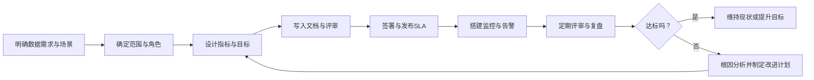

---
tags:
  - 大数据
publish date: 2026-01-05T06:43:00
title: 数据治理之服务水平协议（SLA）
description:
obsidian-note-status:
  - publish
  - colorful:archived
cover:
---

最近在看《DAMA》，之前对服务水平协议（SLA）了解的不多，虽然在开发过程中用到过、或者接触过，但没有在实际数据治理过程中提升到一个应有的高度，所以我想通过本文提升一下对SLA的认识，正好把学习笔记分享一下。

---

# 一、先说结论：数据治理中的 SLA 是什么？

- **SLA（Service Level Agreement，服务水平协议）**  
  本质上是一份“服务承诺书”：服务提供方和接受方之间关于服务要达到什么水平的正式约定，一般包括：
  - 服务内容与边界
  - 可量化的服务目标（比如可用性、延迟、数据质量合格率）
  - 如何测量（指标与计算方法）
  - 达标和未达标时的后果（奖励与处罚）【turn0search0】【turn0search3】【turn0search4】
- 在数据治理里，SLA 被用来：
  - 约定数据平台 / 数据产品 / 数据管道必须达到的“数据质量、时效性、可用性”等标准
  - 明确数据提供方（如数据平台团队）和数据使用方（业务、风控、运营等）之间的责任和期望
  - 让“数据好到什么程度”从口头说法变成可监控、可问责的机制【turn0search1】【turn0search10】【turn0search11】【turn0search17】

也就是说：数据治理中的 SLA，就是把“数据质量和服务水平”这件事用“合同级”的标准讲清楚、量好、盯住。

## 二、用一个示意图看 SLA 在数据治理中的位置

下面这个简单的流程图，展示了数据治理中 SLA 的生命周期（从需求到监控再到改进）。

后面我会按这个思路，详细解释每一步在数据治理里的含义。

## 三、先搞清几个基础概念：SLA / SLO / SLI

在数据治理/云服务里，经常会看到这几个缩写一起出现：

- **SLA（Service Level Agreement，服务水平协议）**
  - 是“协议/合同”
  - 对服务水平和未达标后果的正式约定【turn0search0】【turn0search3】
- **SLO（Service Level Objective，服务目标）**
  - 是“目标值”
  - 比如：“99% 的请求在 200ms 内返回”就是一个 SLO【turn0search2】【turn0search4】
- **SLI（Service Level Indicator，服务指标）**
  - 是“用来测量的指标本身”
  - 比如：“响应时间”、“错误率”、“数据完整性比例”等【turn0search4】【turn0search0】

你可以记住一句话：  
- **SLI 是“尺子”**  
- **SLO 是“尺子上的刻度目标”**  
- **SLA 是“写在合同里的承诺+如果达不到要怎么办”**

## 四、在数据治理中，SLA 通常包含哪些内容？

很多关于“数据 SLA”的实践，会给出一份比较标准的核心结构，比如一般会包含：目的、承诺、度量方式、未达标后果、前提要求、签署方等【turn0search11】。结合数据治理场景，可以概括为：

1. **适用范围与服务对象**
   - 面向哪些系统 / 业务线 / 用户群体？
   - 涉及哪些数据资产（数据集、报表、指标、API）？
2. **角色与职责**
   - 数据提供方：
     - 负责数据采集、加工、存储、监控、故障响应等
   - 数据使用方：
     - 明确需求、反馈问题、遵守访问策略等
   - 数据治理组织（数据委员会 / 数据管家）：
     - 评审、监督、协调跨部门争议
3. **关键服务指标与目标（SLI + SLO）**
   常见几大类：

   - **可用性 / 连通性**
     - 例如：月度系统可用性 ≥ 99.5%
   - **时效性 / 新鲜度（Freshness / Timeliness）**
     - 例如：核心交易数据在交易发生后 5 分钟内写入数仓
     - 日终报表在每天上午 8:00 前完成【turn0search1】【turn0search12】
   - **数据质量指标**
     - 准确性（Accuracy）
     - 完整性（Completeness）
     - 一致性（Consistency）
     - 有效性（Validity）
     - 唯一性（Uniqueness）
     - 等等【turn0search1】【turn0search10】【turn0search13】
   - **性能 / 容量**
     - 查询响应时间（P95、P99 延迟）
     - 并发查询能力
   - **安全与合规**
     - 访问控制策略遵守情况
     - 敏感字段脱敏率、审计覆盖率等

4. **测量方式与数据来源**
   - 指标如何计算：
     - 比如“完整性率 =（非空关键字段数 / 总记录数）× 100%”
   - 数据来自哪里：
     - 任务调度系统日志、监控平台、数据质量检测工具等【turn0search10】【turn0search12】
   - 汇总粒度：
     - 每日/每周/每月统计一次
5. **例外与免责条款**
   - 计划内维护窗口
   - 不可抗力（网络、第三方服务等）
   - 非核心业务场景的低优先级承诺
6. **未达标的后果与改进机制**
   - 补偿措施：
     - 账务抵扣、服务时长补偿（更偏向外部服务商）  
     - 或内部通报、优先级提升、资源追加（组织内部）
   - 根因分析与整改要求：
     - 必须在 N 天内提交 RCA（根因分析报告）
     - 明确整改计划和责任归属【turn0search11】
7. **版本与变更管理**
   - SLA 的生效日期
   - 修订流程：谁发起、评审、批准、通知

## 五、数据治理里几种常见的 SLA 类型

1）数据平台级 SLA

- 面向：整个数据平台/数据中台的所有使用者
- 关注点：
  - 平台整体可用性
  - 核心作业按时完成率
  - 基本访问控制与审计
- 典型例子：
  - “数据平台核心服务月度可用性 ≥ 99.9%”
  - “当日 T+1 核心数仓作业完成时间不晚于 07:00”

2）数据产品 / 数据集 SLA（Data SLA）

- 面向：某一个具体数据产品、报表、指标或 API
- 这是目前讨论最多的一种“数据 SLA”，专门用来约定数据质量和时效【turn0search1】【turn0search12】【turn0search17】
- 关注点：
  - 数据准确性、完整性、一致性
  - 新鲜度/刷新频率
  - 历史数据回溯和修正策略
- 典型例子：
  - “风控特征数据：交易发生后 2 秒内写入风控特征库，准确率 ≥ 99.99%”【turn0search1】
  - “营销宽表：关键字段空值率 ≤ 0.1%，每天 8:00 前就绪”

3）数据质量 SLA

- 面向：某一类/某一表的“数据质量目标”
- 许多数据质量实践都强调，要为数据质量建立明确的 SLA，包括指标、阈值和监控机制【turn0search10】【turn0search11】
- 典型例子：
  - 完整性：主键字段空值率 ≤ 0.01%
  - 唯一性：某自然日内订单 ID 重复率 = 0
  - 合理性：金额字段不能为负，且在合理范围内

4）治理与流程类 SLA

- 面向：数据治理流程本身的服务水平
- 比如元数据管理、数据申请、权限审批等
- 典型例子：
  - 数据权限申请审批：P95 处理时长 ≤ 2 个工作日
  - 数据问题工单响应时间：关键问题 2 小时内响应

## 六、在数据治理流程中，SLA 具体用在哪几个环节？

可以把 SLA 看成数据治理的“控制机制”之一，嵌入到整个流程中：

1. **需求分析与设计阶段**
   - 业务方提出数据需求（要什么字段、多快、多准、用来做什么）
   - 数据治理组织协调定义：
     - 哪些数据资产适用 SLA
     - 要达成哪些业务目标（比如监管报送、线上风控等）
   - 输出：数据资产清单 + 初步 SLA 目标

2. **数据建模与架构设计**
   - 根据 SLA 目标设计：
     - 分层架构（ODS/DW/DM）、主数据、血缘链路等【turn0search18】【turn0search19】
   - 确保从技术上能实现：
     - 时效性要求（分区策略、刷新频率）
     - 质量要求（校验规则、去重和合并策略）

3. **数据开发与测试**
   - 开发过程中落实数据质量校验逻辑、监控埋点
   - 在测试环境验证 SLA 指标能否达标（压测、质量回测）

4. **上线与发布**
   - 正式发布 SLA 文档并完成内部/外部签署
   - 打通：
     - 调度系统（任务完成时间）
     - 数据质量监控（异常规则）【turn0search10】
     - 告警系统（短信/邮件/IM）

5. **运行监控与报告**
   - 定期生成 SLA 执行情况报表：
     - 达标率、故障次数、最长恢复时间等
   - 在数据治理委员会会议中作为重要议题

6. **复盘与持续改进**
   - 对未达标事件进行根因分析，驱动：
     - 数据架构优化
     - 工具/流程改进
     - 责任划分和资源配置调整【turn0search11】【turn0search12】

## 七、为什么数据治理要强调 SLA？（作用与收益）

综合多篇文章对“数据 SLA 重要性”的总结，可以归纳为【turn0search10】【turn0search11】【turn0search17】：

1）让“数据质量”变得可量、可谈、可管

- 把主观的“数据感觉太差”变成具体的：
  - 空值率、错误率、刷新延迟等数字
- 让不同部门在同一套语言下沟通，更容易达成共识

2）明确责任边界，减少“甩锅”

- 数据提供方对“什么时间、到什么质量”负责
- 数据使用方对“需求描述、及时反馈问题”负责
- 出问题时，可以按 SLA 约定的流程和指标去查原因，而不是互相指责

3）提升业务信任

- 业务方看到：
  - 有明确的 SLA
  - 有公开的监控结果
  - 对问题有跟进和整改
- 自然会越来越愿意用数据做决策，而不是拍脑袋

4）支持合规与风险管理

- 很多法规（如金融行业监管）对数据准确性、可追溯性有明确要求
- 数据 SLA 可以把合规要求映射成具体指标和监控，并保留证据【turn0search14】

5）驱动数据平台的工程化与自动化

- SLA 带来“必须持续达标”的压力，会倒逼：
  - 自动化数据质量检测
  - 自动化监控与告警
  - 数据血缘与影响分析工具的使用【turn0search13】【turn0search19】

## 八、实践中设计一个数据 SLA 的简要步骤

可以按下面这个逻辑来落地：

1. **识别关键数据资产**
   - 问自己：哪些数据/指标一旦出错，会对业务、监管、风控产生重大影响？
   - 优先给这些资产定 SLA，而不是“眉毛胡子一把抓”

2. **识别业务场景与用户期望**
   - 与业务方访谈：
     - 最看重什么：准确性？时效性？完整性？
     - 可以容忍的最大延迟和错误率是多少？
   - 例如：实时风控 vs T+1 报表，明显有不同要求【turn0search1】【turn0search17】

3. **选取合适的 SLI（指标）**
   - 时效性：数据就绪时间、最大延迟
   - 质量：准确性、完整性、一致性、唯一性、有效性等【turn0search10】
   - 可用性：服务或任务的成功率
   - 性能：查询响应时间（P95/P99）

4. **设定合理 SLO（目标值）**
   - 不要一开始就追求“5 个 9”，要考虑：
     - 当前能力
     - 技术成本
     - 业务真正价值
   - 一般采用：
     - 基线 → 改进目标 → 逐步拉高的策略【turn0search12】

5. **设计监控与告警**
   - 明确：
     - 指标数据来源
     - 计算逻辑
     - 统计粒度（每天/每周/实时）
   - 设置告警阈值：
     - 预警阈值（例如：轻微偏离目标时先发预警）
     - 违约阈值（触发 SLA 未达标流程）

6. **编写并评审 SLA 文档**
   - 按前面说的结构（范围、角色、指标、测量、例外、后果、版本等）撰写
   - 组织评审：
     - 数据治理委员会、业务方、技术方、法务/合规（如涉及外部协议）

7. **签署、发布与培训**
   - 正式签署（内部可以是邮件审批/工单）
   - 向相关方宣导：
     - 指标含义
     - 看报表的方式
     - 出问题时的处理流程

8. **定期回顾与调优**
   - 每月/每季度复盘：
     - 达标情况
     - 故障案例
     - 改进计划
   - 根据业务变化调整 SLA 内容和目标

## 九、常见误区与注意事项

1）误区：把 SLA 当“合同摆设”

- 只签不完，只写不监控，最后谁都不当真
- 正确做法：从第一天就考虑“怎么监控、怎么出报表、怎么在会上讨论”

2）误区：指标太多、目标太激进

- 指标过多会让人失去重点，监控成本也高
- 目标太激进（比如“错误率必须为 0”）会变成“纸面达标”
- 正确做法：抓住“少而关键”的几个指标，目标合理可达但有挑战

3）误区：只谈技术，不谈业务影响

- 比如“99.9% 可用性”，但如果业务并不真正理解这意味着什么
- 正确做法：用业务语言解释：
  - “在一个月内，最多可能出现 X 次服务不可用，单次不超过 Y 分钟，影响 Z 个报表”

4）误区：把所有数据都放在同一级别 SLA

- 不是所有数据都需要高等级 SLA
- 对“非关键数据”可以用简化的 SLA 或“尽力而为（best effort）”的方式

## 十、一个简化的“数据治理 SLA 条款示例”（假设场景）

假设：公司内部数据平台向风控部门提供“实时交易特征数据”的 SLA 片段：

- 服务对象与范围
  - 服务对象：风控部在线反欺诈系统
  - 数据资产：实时交易特征宽表（按交易 ID 聚合）
- 服务目标
  - 时效性：
    - 99.9% 的交易在交易发生后 2 秒内写入特征库
  - 数据质量：
    - 关键字段空值率 ≤ 0.01%
    - 主键（交易 ID）重复率 = 0（按自然日统计）
  - 可用性：
    - 特征 API 月度可用性 ≥ 99.95%（不计计划维护）
- 测量方式
  - 时效性：通过交易时间戳与特征写入时间戳计算，以监控平台日志为准
  - 数据质量：由每日数据质量任务计算，记录到数据质量报表
- 未达标处理
  - 连续 3 天未达成时效性/质量目标，触发正式复盘会议
  - 因平台侧问题导致的重大业务损失，由数据平台牵头提交改进计划，并在治理例会汇报
- 例外
  - 计划内维护时段（提前 3 个工作日通知）
  - 上游交易系统延迟超过约定阈值时，相应免责

这种具体条款，把抽象的“数据要快、要准”变成了可执行、可检查的东西。

## 十一、小结

- **SLA 本质是“服务承诺 + 可量化指标 + 未达标后果”**，在数据治理中被大量用作数据质量和服务水平的控制工具【turn0search0】【turn0search3】。
- 数据治理中的 SLA（Data SLA、数据质量 SLA 等）重点关注：  
  - 时效性  
  - 数据质量（准确性、完整性、一致性等）  
  - 可用性  
  - 性能  
  - 合规与安全【turn0search1】【turn0search10】【turn0search11】【turn0search17】
- SLA 要落地，需要结合：数据需求分析、架构设计、开发测试、监控告警、复盘改进等环节，形成闭环。
- 好的 SLA 能帮助组织：
  - 把数据质量从“口头要求”变成“工程可管理的目标”
  - 明确责任、减少扯皮
  - 增强业务对数据的信任
  - 支撑合规与风险控制

如果你愿意，我也可以根据你所在行业（比如银行、制造、电商、政务等），帮你设计一份更贴合场景的“数据治理 SLA 模板/清单”。
---

# 一、先说结论：数据治理中的 SLA 是什么？

- **SLA（Service Level Agreement，服务水平协议）**  
  本质上是一份“服务承诺书”：服务提供方和接受方之间关于服务要达到什么水平的正式约定，一般包括：
  - 服务内容与边界
  - 可量化的服务目标（比如可用性、延迟、数据质量合格率）
  - 如何测量（指标与计算方法）
  - 达标和未达标时的后果（奖励与处罚）
- 在数据治理里，SLA 被用来：
  - 约定数据平台 / 数据产品 / 数据管道必须达到的“数据质量、时效性、可用性”等标准
  - 明确数据提供方（如数据平台团队）和数据使用方（业务、风控、运营等）之间的责任和期望
  - 让“数据好到什么程度”从口头说法变成可监控、可问责的机制

也就是说：数据治理中的 SLA，就是把“数据质量和服务水平”这件事用“合同级”的标准讲清楚、量好、盯住。

## 二、用一个示意图看 SLA 在数据治理中的位置

下面这个简单的流程图，展示了数据治理中 SLA 的生命周期（从需求到监控再到改进）。

后面我会按这个思路，详细解释每一步在数据治理里的含义。

## 三、先搞清几个基础概念：SLA / SLO / SLI

在数据治理/云服务里，经常会看到这几个缩写一起出现：

- **SLA（Service Level Agreement，服务水平协议）**
  - 是“协议/合同”
  - 对服务水平和未达标后果的正式约定
- **SLO（Service Level Objective，服务目标）**
  - 是“目标值”
  - 比如：“99% 的请求在 200ms 内返回”就是一个 SLO
- **SLI（Service Level Indicator，服务指标）**
  - 是“用来测量的指标本身”
  - 比如：“响应时间”、“错误率”、“数据完整性比例”等

你可以记住一句话：  
- **SLI 是“尺子”**  
- **SLO 是“尺子上的刻度目标”**  
- **SLA 是“写在合同里的承诺+如果达不到要怎么办”**

## 四、在数据治理中，SLA 通常包含哪些内容？

很多关于“数据 SLA”的实践，会给出一份比较标准的核心结构，比如一般会包含：目的、承诺、度量方式、未达标后果、前提要求、签署方等。结合数据治理场景，可以概括为：

1. **适用范围与服务对象**
   - 面向哪些系统 / 业务线 / 用户群体？
   - 涉及哪些数据资产（数据集、报表、指标、API）？
2. **角色与职责**
   - 数据提供方：
     - 负责数据采集、加工、存储、监控、故障响应等
   - 数据使用方：
     - 明确需求、反馈问题、遵守访问策略等
   - 数据治理组织（数据委员会 / 数据管家）：
     - 评审、监督、协调跨部门争议
3. **关键服务指标与目标（SLI + SLO）**
   常见几大类：

   - **可用性 / 连通性**
     - 例如：月度系统可用性 ≥ 99.5%
   - **时效性 / 新鲜度（Freshness / Timeliness）**
     - 例如：核心交易数据在交易发生后 5 分钟内写入数仓
     - 日终报表在每天上午 8:00 前完成
   - **数据质量指标**
     - 准确性（Accuracy）
     - 完整性（Completeness）
     - 一致性（Consistency）
     - 有效性（Validity）
     - 唯一性（Uniqueness）
     - 等等
   - **性能 / 容量**
     - 查询响应时间（P95、P99 延迟）
     - 并发查询能力
   - **安全与合规**
     - 访问控制策略遵守情况
     - 敏感字段脱敏率、审计覆盖率等

4. **测量方式与数据来源**
   - 指标如何计算：
     - 比如“完整性率 =（非空关键字段数 / 总记录数）× 100%”
   - 数据来自哪里：
     - 任务调度系统日志、监控平台、数据质量检测工具等
   - 汇总粒度：
     - 每日/每周/每月统计一次
5. **例外与免责条款**
   - 计划内维护窗口
   - 不可抗力（网络、第三方服务等）
   - 非核心业务场景的低优先级承诺
6. **未达标的后果与改进机制**
   - 补偿措施：
     - 账务抵扣、服务时长补偿（更偏向外部服务商）  
     - 或内部通报、优先级提升、资源追加（组织内部）
   - 根因分析与整改要求：
     - 必须在 N 天内提交 RCA（根因分析报告）
     - 明确整改计划和责任归属
1. **版本与变更管理**
   - SLA 的生效日期
   - 修订流程：谁发起、评审、批准、通知

## 五、数据治理里几种常见的 SLA 类型

1）数据平台级 SLA

- 面向：整个数据平台/数据中台的所有使用者
- 关注点：
  - 平台整体可用性
  - 核心作业按时完成率
  - 基本访问控制与审计
- 典型例子：
  - “数据平台核心服务月度可用性 ≥ 99.9%”
  - “当日 T+1 核心数仓作业完成时间不晚于 07:00”

2）数据产品 / 数据集 SLA（Data SLA）

- 面向：某一个具体数据产品、报表、指标或 API
- 这是目前讨论最多的一种“数据 SLA”，专门用来约定数据质量和时效
- 关注点：
  - 数据准确性、完整性、一致性
  - 新鲜度/刷新频率
  - 历史数据回溯和修正策略
- 典型例子：
  - “风控特征数据：交易发生后 2 秒内写入风控特征库，准确率 ≥ 99.99%”
  - “营销宽表：关键字段空值率 ≤ 0.1%，每天 8:00 前就绪”

3）数据质量 SLA

- 面向：某一类/某一表的“数据质量目标”
- 许多数据质量实践都强调，要为数据质量建立明确的 SLA，包括指标、阈值和监控机制
- 典型例子：
  - 完整性：主键字段空值率 ≤ 0.01%
  - 唯一性：某自然日内订单 ID 重复率 = 0
  - 合理性：金额字段不能为负，且在合理范围内

4）治理与流程类 SLA

- 面向：数据治理流程本身的服务水平
- 比如元数据管理、数据申请、权限审批等
- 典型例子：
  - 数据权限申请审批：P95 处理时长 ≤ 2 个工作日
  - 数据问题工单响应时间：关键问题 2 小时内响应

## 六、在数据治理流程中，SLA 具体用在哪几个环节？

可以把 SLA 看成数据治理的“控制机制”之一，嵌入到整个流程中：

1. **需求分析与设计阶段**
   - 业务方提出数据需求（要什么字段、多快、多准、用来做什么）
   - 数据治理组织协调定义：
     - 哪些数据资产适用 SLA
     - 要达成哪些业务目标（比如监管报送、线上风控等）
   - 输出：数据资产清单 + 初步 SLA 目标

2. **数据建模与架构设计**
   - 根据 SLA 目标设计：
     - 分层架构（ODS/DW/DM）、主数据、血缘链路等
   - 确保从技术上能实现：
     - 时效性要求（分区策略、刷新频率）
     - 质量要求（校验规则、去重和合并策略）

3. **数据开发与测试**
   - 开发过程中落实数据质量校验逻辑、监控埋点
   - 在测试环境验证 SLA 指标能否达标（压测、质量回测）

4. **上线与发布**
   - 正式发布 SLA 文档并完成内部/外部签署
   - 打通：
     - 调度系统（任务完成时间）
     - 数据质量监控（异常规则）
     - 告警系统（短信/邮件/IM）

5. **运行监控与报告**
   - 定期生成 SLA 执行情况报表：
     - 达标率、故障次数、最长恢复时间等
   - 在数据治理委员会会议中作为重要议题

6. **复盘与持续改进**
   - 对未达标事件进行根因分析，驱动：
     - 数据架构优化
     - 工具/流程改进
     - 责任划分和资源配置调整

## 七、为什么数据治理要强调 SLA？（作用与收益）

综合多篇文章对“数据 SLA 重要性”的总结，可以归纳为：

1）让“数据质量”变得可量、可谈、可管

- 把主观的“数据感觉太差”变成具体的：
  - 空值率、错误率、刷新延迟等数字
- 让不同部门在同一套语言下沟通，更容易达成共识

2）明确责任边界，减少“甩锅”

- 数据提供方对“什么时间、到什么质量”负责
- 数据使用方对“需求描述、及时反馈问题”负责
- 出问题时，可以按 SLA 约定的流程和指标去查原因，而不是互相指责

3）提升业务信任

- 业务方看到：
  - 有明确的 SLA
  - 有公开的监控结果
  - 对问题有跟进和整改
- 自然会越来越愿意用数据做决策，而不是拍脑袋

4）支持合规与风险管理

- 很多法规（如金融行业监管）对数据准确性、可追溯性有明确要求
- 数据 SLA 可以把合规要求映射成具体指标和监控，并保留证据

5）驱动数据平台的工程化与自动化

- SLA 带来“必须持续达标”的压力，会倒逼：
  - 自动化数据质量检测
  - 自动化监控与告警
  - 数据血缘与影响分析工具的使用

## 八、实践中设计一个数据 SLA 的简要步骤

可以按下面这个逻辑来落地：

1. **识别关键数据资产**
   - 问自己：哪些数据/指标一旦出错，会对业务、监管、风控产生重大影响？
   - 优先给这些资产定 SLA，而不是“眉毛胡子一把抓”

2. **识别业务场景与用户期望**
   - 与业务方访谈：
     - 最看重什么：准确性？时效性？完整性？
     - 可以容忍的最大延迟和错误率是多少？
   - 例如：实时风控 vs T+1 报表，明显有不同要求

3. **选取合适的 SLI（指标）**
   - 时效性：数据就绪时间、最大延迟
   - 质量：准确性、完整性、一致性、唯一性、有效性等
   - 可用性：服务或任务的成功率
   - 性能：查询响应时间（P95/P99）

4. **设定合理 SLO（目标值）**
   - 不要一开始就追求“5 个 9”，要考虑：
     - 当前能力
     - 技术成本
     - 业务真正价值
   - 一般采用：
     - 基线 → 改进目标 → 逐步拉高的策略

5. **设计监控与告警**
   - 明确：
     - 指标数据来源
     - 计算逻辑
     - 统计粒度（每天/每周/实时）
   - 设置告警阈值：
     - 预警阈值（例如：轻微偏离目标时先发预警）
     - 违约阈值（触发 SLA 未达标流程）

6. **编写并评审 SLA 文档**
   - 按前面说的结构（范围、角色、指标、测量、例外、后果、版本等）撰写
   - 组织评审：
     - 数据治理委员会、业务方、技术方、法务/合规（如涉及外部协议）

7. **签署、发布与培训**
   - 正式签署（内部可以是邮件审批/工单）
   - 向相关方宣导：
     - 指标含义
     - 看报表的方式
     - 出问题时的处理流程

8. **定期回顾与调优**
   - 每月/每季度复盘：
     - 达标情况
     - 故障案例
     - 改进计划
   - 根据业务变化调整 SLA 内容和目标

## 九、常见误区与注意事项

1）误区：把 SLA 当“合同摆设”

- 只签不完，只写不监控，最后谁都不当真
- 正确做法：从第一天就考虑“怎么监控、怎么出报表、怎么在会上讨论”

2）误区：指标太多、目标太激进

- 指标过多会让人失去重点，监控成本也高
- 目标太激进（比如“错误率必须为 0”）会变成“纸面达标”
- 正确做法：抓住“少而关键”的几个指标，目标合理可达但有挑战

3）误区：只谈技术，不谈业务影响

- 比如“99.9% 可用性”，但如果业务并不真正理解这意味着什么
- 正确做法：用业务语言解释：
  - “在一个月内，最多可能出现 X 次服务不可用，单次不超过 Y 分钟，影响 Z 个报表”

4）误区：把所有数据都放在同一级别 SLA

- 不是所有数据都需要高等级 SLA
- 对“非关键数据”可以用简化的 SLA 或“尽力而为（best effort）”的方式

## 十、一个简化的“数据治理 SLA 条款示例”（假设场景）

假设：公司内部数据平台向风控部门提供“实时交易特征数据”的 SLA 片段：

- 服务对象与范围
  - 服务对象：风控部在线反欺诈系统
  - 数据资产：实时交易特征宽表（按交易 ID 聚合）
- 服务目标
  - 时效性：
    - 99.9% 的交易在交易发生后 2 秒内写入特征库
  - 数据质量：
    - 关键字段空值率 ≤ 0.01%
    - 主键（交易 ID）重复率 = 0（按自然日统计）
  - 可用性：
    - 特征 API 月度可用性 ≥ 99.95%（不计计划维护）
- 测量方式
  - 时效性：通过交易时间戳与特征写入时间戳计算，以监控平台日志为准
  - 数据质量：由每日数据质量任务计算，记录到数据质量报表
- 未达标处理
  - 连续 3 天未达成时效性/质量目标，触发正式复盘会议
  - 因平台侧问题导致的重大业务损失，由数据平台牵头提交改进计划，并在治理例会汇报
- 例外
  - 计划内维护时段（提前 3 个工作日通知）
  - 上游交易系统延迟超过约定阈值时，相应免责

这种具体条款，把抽象的“数据要快、要准”变成了可执行、可检查的东西。

## 十一、总结一下

- **SLA 本质是“服务承诺 + 可量化指标 + 未达标后果”**，在数据治理中被大量用作数据质量和服务水平的控制工具。
- 数据治理中的 SLA（Data SLA、数据质量 SLA 等）重点关注：  
  - 时效性  
  - 数据质量（准确性、完整性、一致性等）  
  - 可用性  
  - 性能  
  - 合规与安全
- SLA 要落地，需要结合：数据需求分析、架构设计、开发测试、监控告警、复盘改进等环节，形成闭环。
- 好的 SLA 能帮助组织：
  - 把数据质量从“口头要求”变成“工程可管理的目标”
  - 明确责任、减少扯皮
  - 增强业务对数据的信任
  - 支撑合规与风险控制

